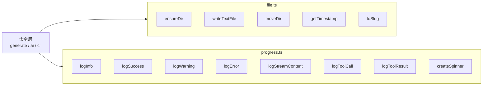

现在信息充足，可以撰写页面了。

# 文件工具与进度显示

Wiki CLI 的底层基础设施由两个工具模块构成：`src/utils/file.ts` 提供文件系统操作的统一封装，`src/utils/progress.ts` 提供终端交互的日志与进度指示。它们不解决业务逻辑，而是为上层命令（[CLI入口与命令体系](cli入口与命令体系.md)、[生成Wiki文档](生成wiki文档.md)、[AI代码问答](ai代码问答.md)等）提供可组合的基础能力。

---

## 文件工具（`file.ts`）

模块从 `node:fs/promises`、`node:fs` 和 `node:path` 引入原生 Node.js API，在此基础上封装了 9 个导出函数，覆盖目录创建、文件读写、目录移动和字符串格式化四类操作。

### 目录与文件操作

| 函数 | 签名 | 说明 |
|---|---|---|
| `ensureDir` | `(dirPath: string) => Promise<void>` | 递归创建目录，等价 `mkdir -p` |
| `fileExists` | `(filePath: string) => Promise<boolean>` | 同步检查文件存在性 |
| `readTextFile` | `(filePath: string) => Promise<string>` | 以 UTF-8 读取文件 |
| `writeTextFile` | `(filePath: string, content: string) => Promise<void>` | 自动创建目标目录后写入 UTF-8 文件 |
| `removeDir` | `(dirPath: string) => Promise<void>` | 递归删除目录（如存在） |
| `listDir` | `(dirPath: string) => Promise<string[]>` | 列出目录下的所有条目名 |
| `moveDir` | `(src: string, dest: string) => Promise<void>` | 重命名/移动目录 |

[来源](src/utils/file.ts#L1-L32)

`writeTextFile` 的设计值得注意：它在写入前自动从路径中提取目录部分并调用 `ensureDir`，调用者无需先手动创建目录。具体实现为分割路径字符串、丢掉最后一段（文件名）后调 mkdir。

```typescript
await ensureDir(filePath.split(sep).slice(0, -1).join(sep));
```

[来源](src/utils/file.ts#L16-L19)

`removeDir` 内置存在性检查，避免对不存在的路径报错——这在清理临时目录（如生成过程中的 `.wiki/temp`）时格外实用。

[来源](src/commands/generate.ts#L48)

### 时间戳与 Slug

```typescript
// 输出格式：2026-01-15T14-30-00
```

`getTimestamp` 生成 **ISO 风格但去除冒号** 的时间戳。标准 ISO 8601 格式中的 `14:30:00` 含有冒号，在文件系统（尤其是 Windows NTFS）和 URL 中可能引发问题。该函数用连字符替代冒号，既保留了排序友好的 `YYYY-MM-DDTHH-MM-SS` 结构，又规避了跨平台兼容问题。

```typescript
export function getTimestamp(): string {
  const now = new Date();
  const y = now.getFullYear();
  const M = String(now.getMonth() + 1).padStart(2, '0');
  // ... 省略 padStart 处理
  return `${y}-${M}-${d}T${h}-${m}-${s}`;
}
```

[来源](src/utils/file.ts#L34-L43)

`toSlug` 将任意标题转化为可用作文件名的 URL-safe 字符串。其正则拆分逻辑为：

```typescript
title
  .toLowerCase()
  .replace(/[^\w\u4e00-\u9fff]+/g, '-')
  .replace(/^-+|-+$/g, '')
  || 'untitled';
```

- `\w` 匹配字母、数字和下划线
- `\u4e00-\u9fff` 匹配常用 CJK 统一表意文字（中日韩）

**关键设计意图**：在 `\w` 基础上显式加入中文字符范围，确保中文标题不会被全部移除。若不做此处理，`"文件工具与进度显示"` 经 `\w` 过滤后将变成空字符串（`-` 被保留但首尾裁切后为空），回退为 `'untitled'`。加上中文范围后，结果变为 `文件工具与进度显示`。

末尾的 `|| 'untitled'` 是兜底保护：当标题全是特殊字符时不会返回空字符串。

[来源](src/utils/file.ts#L45-L52)

这两个函数在生成流程中配对出现：`getTimestamp()` 创建版本化目录（如 `2026-01-15T14-30-00`），`toSlug(title)` 生成每个页面的文件名。

[来源](src/commands/generate.ts#L12-L12)

---

## 进度显示（`progress.ts`）

模块引入 `ora` 和 `chalk` 两个轻量级依赖，提供两类终端交互原语：日志函数和旋转进度指示器。

### 7 个日志函数

每个函数负责一种视觉层级，统一输出到 `console` 或 `process.stdout`：

| 函数 | 前缀符号 | 颜色 | 输出目标 |
|---|---|---|---|
| `logInfo(msg)` | `ℹ` | 蓝色 | `console.log` |
| `logSuccess(msg)` | `✔` | 绿色 | `console.log` |
| `logWarning(msg)` | `⚠` | 黄色 | `console.log` |
| `logError(msg)` | `✖` | 红色 | `console.log` |
| `logStreamContent(content)` | 无前缀 | 青色 | `process.stdout.write` |
| `logToolCall(name, args)` | `🔧` | 品红 | `console.log` |
| `logToolResult(name, result)` | `↳` | 绿色+灰色 | `console.log` |

[来源](src/utils/progress.ts#L1-L28)

前四个函数（Info/Success/Warning/Error）构成**分级日志系统**，CLI 入口 `cli.ts` 在最外层用 `logError` 统一捕获命令抛出的异常：

```typescript
} catch (err: any) {
  logError(err.message);
  process.exit(1);
}
```

[来源](src/cli.ts#L193-L196)

`logStreamContent` 与 `process.stdout.write` 配合，用于流式场景——[LLM客户端设计](llm客户端设计.md)中逐块输出 AI 回复时，需要在同一行持续追加，而非换行打印。

`logToolCall` 和 `logToolResult` 构成一对调试输出，在生成流程中被串联调用：

```typescript
logToolCall(name, args);
const result = await executeToolCall(name, args, toolContext);
logToolResult(name, result);
```

[来源](src/commands/generate.ts#L15-L15)

`logToolResult` 对长字符串做了截断预览（取前 100 字符），避免单条日志撑满终端。

[来源](src/utils/progress.ts#L26-L28)

### createSpinner

```typescript
export function createSpinner(text: string) {
  return ora(text).start();
}
```

[来源](src/utils/progress.ts#L4-L6)

这是对 `ora` 库的极薄封装：传入文字即启动旋转动画，返回的 `ora.Ora` 实例可调用 `.succeed()` / `.fail()` / `.stop()` 切换状态。虽然当前 `src/` 目录内部尚未直接使用它，但作为工具导出供外部调用或后续集成预留——在设计上保持 CLI 工具包的完整性。

---

## 模块分工与调用关系

两个模块在整个项目中承担不同的抽象层级：



`file.ts` 处理**数据持久化**——目录结构、文件读写、版本目录命名；`progress.ts` 处理**人机交互**——通知、警告、错误提示和流式内容呈现。所有命令模块都同时依赖二者。

---

## 推荐阅读

- [生成Wiki文档](生成wiki文档.md) — 两个模块最主要的消费者，看它们如何在两阶段生成流程中协同
- [CLI入口与命令体系](cli入口与命令体系.md) — `cli.ts` 中的全局异常捕获如何调用 `logError`
- [AI代码问答](ai代码问答.md) — 流式日志 `logStreamContent` 的实际使用场景