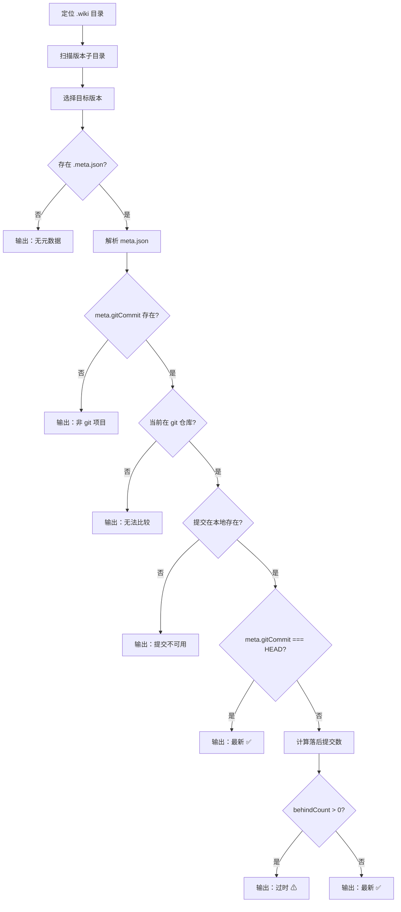

# 查看Wiki状态

`wiki-cli status` 是一条信息查询命令——它不修改任何文件，只做一件事：**告诉你 Wiki 文档与当前代码库之间有多大的"代差"**。这种代差检测基于 Git 提交历史的精确比对，而非修改时间的粗略比较。

## 命令入口与选项

`status` 命令通过 Commander.js 注册，支持五个选项：

| 选项 | 用途 |
|------|------|
| `-v, --version <ts>` | 指定要检查的 Wiki 版本时间戳（默认取最新版） |
| `-C, --dir <path>` | 项目目录路径（默认当前目录） |
| `-u, --url <url>` | 远程仓库 URL（查缓存 Wiki） |
| `--log` | 显示自 Wiki 生成以来的 git 提交日志 |
| `--stat` | 显示带文件变更统计的 git 日志 |

命令签名定义在 `cli.ts` 第 103-117 行，实际处理入口为 `statusCommand(options)`。[来源](src/cli.ts#L103-L117)

## 核心流程：五步检测

整个检测过程的逻辑可以用一条决策链概括：



### 1. 定位 Wiki 目录

按优先级确定 `.wiki` 目录位置：

- **`--url` 模式**：调用 `defaultRepoDir(url)` 将 URL 转换为本地缓存路径（形如 `~/.wiki-cli/repos/github-com-user-repo`），再拼接 `.wiki` 子目录。[来源](src/utils/workspace.ts#L25-L27)
- **`--dir` 模式**：解析指定路径，若包含 `.wiki` 子目录则进入，否则将路径本身视为 Wiki 目录。[来源](src/commands/status.ts#L23-L24)
- **默认模式**：取当前工作目录的 `.wiki` 子目录。[来源](src/commands/status.ts#L26)

### 2. 版本目录扫描

读取 `.wiki` 目录下的所有子目录，过滤掉 `temp` 和 `sessions` 这两个系统目录，剩余目录名即为 Wiki 版本。版本名是生成时的时间戳（格式如 `20250115_143022`），按字符串降序排列——最新的在前。[来源](src/commands/status.ts#L30-L35)

### 3. 元数据解析

打开目标版本目录下的 `.meta.json` 文件。这个文件在 Wiki 生成时由[生成引擎](生成wiki文档.md)写入，包含三个字段：

```json
{
  "generatedAt": "2025-01-15 14:30:22",
  "gitCommit": "a1b2c3d4e5f6...",
  "gitBranch": "main",
  "gitRemote": "https://github.com/user/repo.git"
}
```

`generatedAt` 总是存在；`gitCommit`、`gitBranch`、`gitRemote` 则只有在生成时项目是 Git 仓库时才存在。[来源](src/commands/generate.ts#L210-L218)

### 4. Git 提交比对

这是最核心的检测逻辑。命令依次执行三个 Git 操作：

**步骤一：获取当前 HEAD**

```typescript
currentCommit = execSync('git rev-parse HEAD', { cwd }).trim();
```

若执行失败，说明当前目录不是 Git 仓库。[来源](src/commands/status.ts#L66-L68)

**步骤二：验证提交存在性**

```typescript
execSync(`git cat-file -t ${meta.gitCommit}`, { cwd, stdio: 'ignore' });
```

`git cat-file -t` 返回对象的类型（`commit`、`tree`、`blob` 等）。如果指定的提交不在此仓库的对象数据库中，该命令会抛出异常——这通常发生在 **rebase** 之后（历史被重写）或切换到了不同的远程仓库。[来源](src/commands/status.ts#L80-L85)

**步骤三：计算落后提交数**

```typescript
behindOutput = execSync(`git log --oneline ${meta.gitCommit}..HEAD`, { cwd }).trim();
behindCount = behindOutput ? behindOutput.split('\n').length : 0;
```

`A..HEAD` 语法表示"从 A 之后到 HEAD 的所有提交"，结果数量就是 Wiki 落后于当前代码的提交数。若输出为空，说明 `meta.gitCommit` 与 HEAD 指向相同的提交（behindCount = 0）。若命令本身异常（例如提交不在当前分支的历史链上），behindCount 置为 -1。[来源](src/commands/status.ts#L99-L103)

### 5. 状态输出

每种检测结果对应不同的输出样式，全部汇总如下：

| 条件 | 状态文字 | 颜色 |
|------|----------|------|
| 无 `.meta.json` | `该版本生成时尚未启用元数据追踪` | 黄 |
| `meta.gitCommit` 不存在 | `—`（灰色） | 灰 |
| 当前不是 Git 仓库 | `当前不在 git 仓库，无法比较` | 黄 |
| 提交在本地不存在 | `提交记录不可用（可能经历了 rebase 或切换了 remote）` | 黄 |
| `meta.gitCommit === HEAD` | `Wiki 是最新的` | 绿 ✅ |
| 落后 > 0 | `Wiki 已过时` | 黄 ⚠ |
| 无法计算落后数 | `无法比较（提交不在当前历史中）` | 黄 |

对于命中"过时"状态的版本，额外显示落后提交数量（如 `落后: 5 commits`）。[来源](src/commands/status.ts#L42-L125)

## --log 与 --stat：查看变更详情

当 Wiki 已过时，两个可选标志可以展示具体的代码变更内容：

- **`--log`**：执行 `git log --oneline <commit>..HEAD`，每行一条简短提交记录（缩写哈希 + 标题）。
- **`--stat`**：执行 `git log --stat <commit>..HEAD`，每条提交附带变更的文件列表和增删行数统计。

输出前会打印分隔标题 `── 变更日志 ──`，每行前加三个空格缩进，保持与控制台对齐。[来源](src/commands/status.ts#L111-L120)

## formatCommit：友好显示提交引用

辅助函数 `formatCommit(ref)` 尝试执行 `git log -1 --format="%h %s"` 将完整 SHA 转换为"缩写哈希 + 提交标题"形式。若失败（例如引用在本地对象库中不存在），则截取前 12 个字符并追加 `...`。[来源](src/commands/status.ts#L128-L133)

## 边界情况

- **多版本共存**：`.wiki` 目录下可保留多个时间戳版本。指定 `--version` 可检查任意历史版本的状态。[来源](src/commands/status.ts#L38-L41)
- **目录名冲突**：如果项目目录下存在名为 `temp` 或 `sessions` 的目录，它们会被自动排除，不会误判为 Wiki 版本。[来源](src/commands/status.ts#L32)
- **URL 缓存复用**：`--url` 模式下，命令直接查找 `~/.wiki-cli/repos/` 下的缓存目录，无需重新克隆。若缓存不存在，`status` 命令会输出错误并退出，不会触发自动克隆。[来源](src/utils/workspace.ts#L15-L27)

## 推荐阅读

- [概览](概览.md)——了解 Wiki 整体架构
- [生成Wiki文档](生成wiki文档.md)——理解 `.meta.json` 的写入时机
- [工作目录解析与Git集成](工作目录解析与git集成.md)——深入 `defaultRepoDir` 和缓存机制