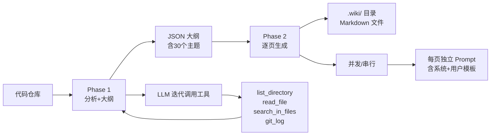

现在已有足够信息，开始编写"概览"页面。

***

# Wiki CLI 概览

**Wiki CLI** 是一个命令行工具，能对任意本地或远程 Git 仓库一键生成结构化 Wiki 文档。你只需执行一条命令，LLM 就会分析全部源代码，输出一套可浏览、可搜索、可交互的技术文档。

```bash
wiki-cli generate    # 分析代码 → 生成 Wiki
wiki-cli browse      # 本地浏览器查看
wiki-cli ai          # 和 AI 对话，追问代码细节
```

工具同时为 AI Agent（如 opencode）提供了标准化接口，让 AI 在回答问题时能真实地读取你的源码和 Wiki，而不是凭空猜测。

---

## 六条命令，各司其职

整个 CLI 由 6 条命令组成，它们在 `src/cli.ts` 中通过 Commander.js 注册和分发。每条命令解决一个独立场景：

| 命令 | 一句话能力 | 典型用途 | 适用用户 |
|------|-----------|---------|---------|
| `wiki-cli config` | 交互式配置 LLM Provider、Model、API Key、语言 | 首次使用、更换模型、切换 Embedding 服务 | 所有用户 |
| `wiki-cli generate` | 分析仓库并生成全套 Wiki 页面 | 新项目生成文档、更新原有文档 | 文档创建者 |
| `wiki-cli browse` | 启动 HTTP 服务器，在浏览器中查看 Wiki | 阅读生成的 Wiki、切换版本、查看源码 | 文档读者 |
| `wiki-cli ai` | 基于代码库的交互式 AI 问答 | 了解项目架构、追问实现细节、排查代码 | 开发者 |
| `wiki-cli status` | 对比 Wiki 版本与当前代码库的差异 | 检查文档是否过期、查看代码变动日志 | 项目维护者 |
| `wiki-cli tool-call` | 以 JSON 格式调用内置工具（为 AI Agent 设计） | AI Agent 集成、脚本调用、自动化流程 | AI Agent 开发者 |

**命令注册和参数解析**见[CLI入口与命令体系](cli入口与命令体系.md)的完整说明。[来源](src/cli.ts#L1-L10)

`config` 是**使用的前提**——没有配置 LLM，任何其他命令都无法工作。[来源](src/commands/config.ts#L7-L10)

`generate` 是**核心命令**，承载两阶段生成引擎。[来源](src/commands/generate.ts#L1-L10)

`browse` 和 `ai` 是**消费命令**，分别面向文档读者和代码提问者。[来源](src/commands/browse.ts#L1-L10) [来源](src/commands/ai.ts#L1-L10)

`status` 是**质量保障命令**，帮你判断 Wiki 是否与代码保持同步。[来源](src/commands/status.ts#L1-L10)

`tool-call` 是**集成命令**，让外部 AI Agent 能复用 Wiki CLI 的全部只读工具。[来源](src/commands/tool-call.ts#L1-L10)

---

## 两阶段生成流程

生成 Wiki 不是一次请求搞定全部页面，而是分为 **Phase 1（大纲阶段）**和 **Phase 2（页面生成阶段）**，两个阶段由 `generateCommand` 函数串联执行。[来源](src/commands/generate.ts#L119-L140)



### Phase 1：生成大纲

LLM 先以**系统分析师**的角色探索代码仓库。它调用 `list_directory`、`read_file`、`search_in_files` 等只读工具来理解项目结构和核心逻辑，然后输出一份 **JSON 格式的大纲**，包含最多 30 个主题，每个主题标有标题、难度等级、简介和写作指令。[来源](src/commands/generate.ts#L236-L280)

```json
{
  "sections": [
    {
      "name": "入门指南",
      "topics": [
        { "level": "初学", "title": "概览", "description": "...", "task": "..." },
        { "level": "初学", "title": "快速开始", "description": "...", "task": "..." }
      ]
    },
    {
      "name": "深入探索",
      "topics": [
        { "level": "高级", "title": "两阶段生成引擎", "description": "...", "task": "..." }
      ]
    }
  ]
}
```

大纲被保存为 `_outline.json`，使得后续页面生成时可以互相引用。[来源](src/commands/generate.ts#L265-L267)

### Phase 2：生成页面

拿到大纲后，LLM 切换为**架构分析型技术作者**，为每个主题独立生成 Markdown 页面。系统提示词来自 `prompts/page-system.md`，用户提示词来自 `prompts/page-user.md`，通过 `renderPrompt` 函数注入工作目录、页面标题、难度等级等变量。[来源](src/commands/generate.ts#L495-L530) [来源](src/ai/prompts.ts#L1-L20)

页面可以**串行**（逐页实时流式输出）或**并行**（多页并发，默认 3 个并发）。如果中途中断，再次运行会检测临时目录并询问是否**断点续传**。[来源](src/commands/generate.ts#L110-L120) [来源](src/commands/generate.ts#L143-L150)

生成完成后，`.wiki/` 目录下会出现以时间戳命名的版本目录，内含全部 Markdown 文件和索引。

**详细流程**参见[两阶段生成引擎](两阶段生成引擎.md)和[生成Wiki文档](生成wiki文档.md)。

---

## AI Agent 整合模式

Wiki CLI 不仅为你生成文档，还为 AI Agent（如 opencode 等）暴露了一个**标准化的工具接口**。

### `tool-call` 命令

AI Agent 通过 `wiki-cli tool-call <toolName> '<jsonArgs>'` 调用任何内置工具，输出纯 JSON 到 stdout。[来源](src/commands/tool-call.ts#L1-L27)

```bash
wiki-cli tool-call semantic_search '{"query": "authentication"}'
# → {"type":"success","data":"..."}

wiki-cli tool-call read_wiki '{"slug": "快速开始"}'
# → {"type":"success","data":"...content..."}
```

### 13 个只读工具

工具定义在 `src/ai/tools.ts` 的 `toolDefinitions` 数组中，全部是**只读操作**，不会修改你的项目文件：[来源](src/ai/tools.ts#L1-L20)

| 类别 | 工具 | 用途 |
|------|------|------|
| 目录 | `list_directory`, `list_files` | 探索项目结构 |
| 文件 | `read_file`, `search_in_files` | 读取和搜索代码 |
| Git | `git_log`, `git_show`, `git_remote_info` | 查看提交历史 |
| Wiki | `list_wiki_pages`, `read_wiki`, `search_wiki`, `semantic_search` | 读取和搜索 Wiki 文档 |
| 网络 | `fetch_web_markdown` | 抓取文档 URL |
| 模板 | `dotenv_template` | 读取环境变量模板 |

### 整合效果

当 AI Agent 接到用户问题（如"这个项目如何做认证？"），它会：
1. 用 `semantic_search` 在 Wiki 中搜索相关页面
2. 用 `read_wiki` 读取页面内容
3. 用 `read_file` 验证实际代码
4. 给出带源码引用的精确回答

详细机制参见[工具系统与Function Calling](工具系统与function-calling.md)和[AI Agent Skill集成](ai-agent-skill集成.md)。

---

## 设计原则

整个项目遵循三个核心设计原则：

### 1. Prompt 与代码分离

所有 LLM 对话的系统提示词被抽离为独立的 `.md` 文件，存放在 `prompts/` 目录下：[来源](src/ai/prompts.ts#L1-L8)

```
prompts/
├── outline-system.md    # 大纲阶段：分析师角色
├── outline-user.md      # 大纲阶段：用户输入
├── page-system.md       # 页面阶段：技术作者角色
├── page-user.md         # 页面阶段：用户输入
└── ai-system.md         # AI 问答：代码分析师角色
```

不修改代码即可调整提示词，更易调试和迭代。详见[Prompt模板系统](prompt模板系统.md)。

### 2. 只读工具

LLM 在生成大纲和回答问题时调用的所有工具都是**只读**的。它们能列出目录、读取文件、搜索代码、查看 Git 历史，但无法创建、修改或删除任何文件。这保证了即使 LLM 误操作，也不会损坏你的项目。[来源](src/ai/tools.ts#L1-L20)

### 3. JSON 大纲

大纲不是自然语言描述，而是结构化 JSON。这个 JSON 被保存后，Phase 2 的每个页面生成器都能看到所有页面的标题、简介和 slug，从而在页面中生成**交叉引用链接**。文档之间不孤立，读者可以在页面间自然跳转。[来源](src/commands/generate.ts#L508-L513)

---

## 项目结构一览

```
wiki-cli/
├── src/
│   ├── cli.ts                  # 入口 + Commander 命令注册
│   ├── commands/               # 6 条命令的实现
│   │   ├── config.ts
│   │   ├── generate.ts
│   │   ├── browse.ts
│   │   ├── status.ts
│   │   ├── ai.ts
│   │   └── tool-call.ts
│   ├── ai/                     # AI 引擎
│   │   ├── llm-client.ts       # 流式/非流式 API 客户端
│   │   ├── tools.ts            # 13 个只读工具定义与执行
│   │   ├── prompts.ts          # Prompt 模板加载与渲染
│   │   ├── embeddings.ts       # 语义搜索
│   │   └── ai-session.ts       # 会话管理
│   ├── config/
│   │   └── config-store.ts     # 配置持久化
│   └── utils/
│       ├── file.ts             # 文件操作
│       ├── workspace.ts        # 工作目录解析
│       ├── git.ts              # Git 操作
│       └── progress.ts         # 进度显示
├── prompts/                    # 5 个 prompt 模板
└── tests/                      # 测试用例
```

---

## 下一步

- 还没配置？→ [快速开始](快速开始.md) — 5 分钟完成全部配置和首次生成
- 想深入了解生成流程？→ [两阶段生成引擎](两阶段生成引擎.md)
- 想把 Wiki CLI 集成到你的 AI Agent？→ [AI Agent Skill集成](ai-agent-skill集成.md)
- 关心代码质量？→ [查看wiki状态](查看wiki状态.md) 了解版本差异检查