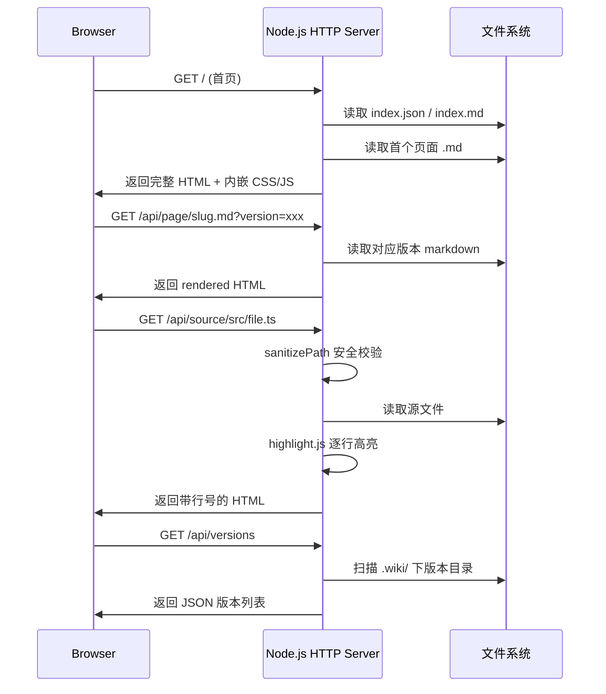
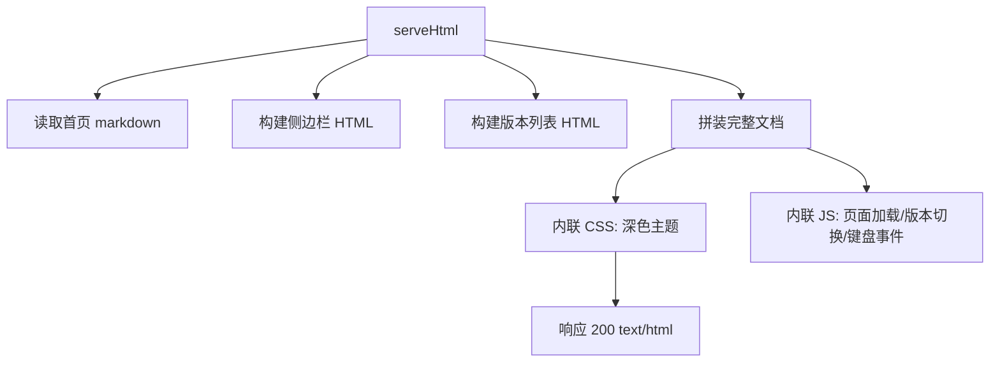

> **受众水平**：中级 — 需要理解 HTTP 服务器设计、单页应用架构与安全编程模式

---

# 浏览 Wiki：纯前端浏览器的服务端实现

当你运行 `wiki-cli browse`，一个完整的 Wiki 浏览器就在本地启动。这个浏览器不是静态文件服务器，而是一个**内嵌渲染引擎的单页应用（SPA）后端**：服务端负责路由分发、Markdown 转 HTML、代码高亮、安全校验，客户端负责交互、版本切换和二次渲染。

## 整体架构



服务器启动后不做文件监听，所有路由按需读取磁盘。这意味着你可以在浏览同时重新生成 Wiki，刷新即生效。[来源](src/commands/browse.ts#L1-L10)

## 端口探测：findFreePort

启动时会从 **3000** 开始查找可用端口，若被占用则递归递增。核心机制是创建一个**临时 HTTP 服务器**尝试 `listen`，成功则关闭并返回该端口，失败则重试 `preferred + 1`：

```typescript
async function findFreePort(preferred: number): Promise<number> {
  return new Promise((resolve) => {
    const srv = createServer();
    srv.listen(preferred, () => {
      const addr = srv.address();
      if (addr && typeof addr === 'object') {
        srv.close(() => resolve(addr.port));
      } else {
        srv.close(() => resolve(preferred));
      }
    });
    srv.on('error', () => resolve(findFreePort(preferred + 1)));
  });
}
```

这种方式的优势是**原子性**：`listen` 成功即确认端口可用，不存在竞态条件。与常见的 `createConnection` 探测法相比，它更可靠但单次尝试开销稍大（创建完整 server 对象）。[来源](src/commands/browse.ts#L367-L379)

## Sidebar 加载：loadSidebar 的双格式设计

侧边栏数据来源有两个路径，按优先级尝试：

| 格式 | 文件 | 解析方式 | 适用场景 |
|------|------|----------|----------|
| JSON | `index.json` | `parseIndexJson` — 解析 `sections[].topics[]`，支持 `type: "group"` 分组 | 生成引擎输出（推荐） |
| XML-like | `index.md` | `parseIndexXml` — 解析 `<section><topic level="...">标题</topic>` 标签 | 手动编写或旧版兼容 |

两种解析结果统一为 `SidebarItem[]` 接口：

```typescript
interface SidebarItem {
  title: string;   // 显示标题
  slug: string;    // URL 友好标识（空字符串表示分组标题）
  level: string;   // "初学" | "中级" | "高级"，用于显示 🟢🟡🔴 标记
}
```

JSON 解析前会调用 `stripCodeFence` 清理可能包裹的代码块标记 —— 这是因为生成引擎可能将 JSON 包裹在 markdown 代码块中输出。[来源](src/commands/browse.ts#L244-L325)

## 页面内容渲染：marked + highlight.js + Mermaid

当浏览器请求 `/api/page/slug.md` 时，服务端做三件事：

1. **marked 解析**：将 markdown 字符串转为 HTML
2. **来源链接转换**：调用 `fixContentReferences`，将 `[来源：路径]` 模式替换为指向 `/api/source/` 的可点击链接
3. **返回 HTML 片段**：前端接收到后注入到 `#content` 容器

前端加载完成后，客户端脚本进一步调用 `hljs.highlightAll()` 和 `mermaid.run()` 完成代码块高亮和图表的客户端渲染：

```javascript
hljs.highlightAll();
try { await mermaid.run({ nodes: document.querySelectorAll('.mermaid') }); } catch {}
```

这种**服务端渲染 + 客户端增强**的混合模式，兼顾了首屏速度和交互灵活性。选择 highlight.js 而非 Prism，是因为它支持的语言更多且内置了 dark 主题。[来源](src/commands/browse.ts#L108-L127)

## 版本切换：api/versions 接口

Wiki 每次生成都会在 `.wiki/` 下创建一个**以时间戳命名的目录**（格式如 `2024-03-21T10-30-00`）。服务端启动时扫描所有目录（排除 `temp` 和 `sessions`），按字母降序排列，第一个即为最新版本。

`/api/versions` 返回 JSON 数组：

```json
[
  { "ts": "2024-03-21T10-30-00", "current": true },
  { "ts": "2024-03-20T09-15-00", "current": false }
]
```

版本切换的实现细节在客户端：`switchVersion(ts)` 通过修改 URL `?version=xxx` 参数触发整页刷新。侧边栏的"历史版本"按钮弹出浮层展示所有版本，点击即切换。[来源](src/commands/browse.ts#L95-L104)

## 源码查看与路径安全：sanitizePath

`/api/source/` 路径用于在浏览器中查看项目源代码。这是最敏感的路由 —— 既要展示源码，又要**防止路径遍历攻击**：

```typescript
function sanitizePath(rawPath: string, root: string): string | null {
  const cleaned = rawPath.replace(/^[/\\]+/, '');
  const normalized = normalize(cleaned).replace(/^(\.\.(\/|\\))+/g, '');
  const resolved = resolve(root, normalized);
  if (!resolved.startsWith(root + sep) && resolved !== root) return null;
  return normalized;
}
```

安全链分三步：

1. **去除前导斜杠** — 防止绝对路径注入
2. **normalize 后剥离 `../`** — 正则替换掉所有目录回溯前缀
3. **resolve 后校验前缀** — 确认最终路径仍在 `projectRoot` 范围内

如果校验失败，返回 `null`，服务端回复 **403 Forbidden**。

源文件渲染时，服务端**逐行调用 highlight.js** 进行高亮，生成带行号的 `<div class="line">` 结构。行号支持 URL 锚点定位（`#L10-L20`），前端通过 `DOMContentLoaded` 事件解析 hash 并高亮对应行段。[来源](src/commands/browse.ts#L130-L219)

## serveHtml：内嵌单页应用

`serveHtml` 函数是首页入口，它的输出是一个**完整的 HTML 文档**，内嵌了全部 CSS 样式和 JavaScript 交互逻辑，没有任何外部依赖（除了 CDN 加载的 highlight.js 和 Mermaid）。



关键交互逻辑包括：

- **页面加载**（`loadPage`）：fetch `/api/page/`，替换 `#content`，触发 hljs 和 mermaid 重新渲染
- **内部链接拦截**：监听 `#content` 的点击事件，`.md` 结尾的链接走 AJAX 加载，其余路径打开源码窗口
- **键盘快捷键**：`Escape` 关闭版本浮层
- **浏览器历史**：通过 `history.replaceState` 同步 URL hash，支持前进/后退

CSS 采用 GitHub Dark 风格配色，所有颜色变量直接硬编码在模板字符串中，无需额外的主题文件。[来源](src/commands/browse.ts#L381-L505)

## 来源链接：从 Markdown 到可点击引用

Wiki 文档中 `[来源：路径]` 的引用标记，在渲染时被 `fixContentReferences` 转换为超链接：

```typescript
function fixContentReferences(html: string): string {
  return html.replace(/\[来源：([^\]]+)\]/g, 
    '<a href="/api/source/$1" target="_blank" class="source-ref">[来源]</a>');
}
```

生成的链接以 `source-ref` 样式呈现（带边框的小标签），点击后在新窗口打开对应源码，实现了**文档与代码的双向追溯**。每个 Wiki 页面末尾的引用链接正是依赖此机制工作。[来源](src/commands/browse.ts#L469-L471)

---

## 路由总览

| 路径 | 方法 | 功能 | 安全措施 |
|------|------|------|----------|
| `/` | GET | 返回 SPA 首页 | — |
| `/api/versions` | GET | 版本列表 JSON | 仅扫描 `temp`/`sessions` 外的目录 |
| `/api/page/*.md` | GET | 返回渲染后的 HTML 片段 | 检查文件存在性 |
| `/api/source/*` | GET | 源码查看（带行号） | `sanitizePath` 路径校验 |
| `*.md`（非 `/api/`） | GET | 302 跳转到 `/api/page/` | — |
| 其他静态资源 | GET | 按 MIME 类型返回 | 限制扩展名白名单 |

[来源](src/commands/browse.ts#L72-L226)

---

## 推荐阅读

- [HTTP服务器与Markdown渲染](http服务器与markdown渲染.md) — 本文的完整版，聚焦渲染管线
- [源码查看与版本切换](源码查看与版本切换.md) — 深入行号高亮和版本系统的实现
- [两阶段生成引擎](两阶段生成引擎.md) — 理解 `.wiki/` 目录结构如何被生成
- [生成Wiki文档](生成wiki文档.md) — 生成引擎的入口与流程