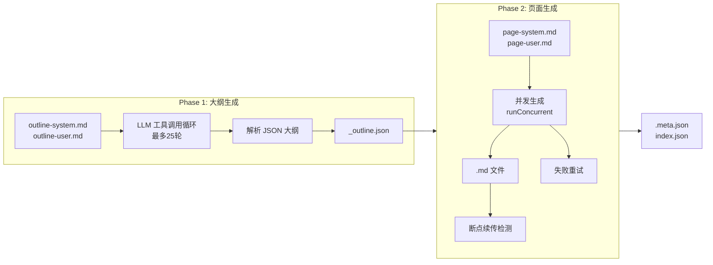

## 两阶段生成引擎：从代码到结构化文档的完整管道

`generate` 命令是整个 wiki-cli 的核心——它将一个原始代码仓库转化为结构化、多页面的开发者文档。这个转化过程被分解为两个截然不同的阶段：**Phase 1（大纲生成）**和 **Phase 2（页面生成）**，中间以 JSON 大纲作为契约。



整个流程从 `generateCommand()` 函数启动，它依次调用 `generateOutline()` 和 `generatePages()`，最后写入元数据和索引文件。[来源](src/commands/generate.ts#L60-L63)

---

### Phase 1：大纲生成——让 LLM 理解你的代码库

Phase 1 的核心目标不是直接写页面，而是让 LLM **先读懂整个仓库**，然后输出一个结构化的 JSON 目录。这个目录定义了后续要生成哪些页面、每页的难度等级、内容和写作任务。

#### 指令模板如何驱动 LLM

两条 Prompt 模板共同驱动这一阶段：

- **`outline-system.md`**：角色的**系统级定义**，将 LLM 设定为"资深软件工程师兼技术文档专家"。它定义了分析框架（高层愿景 → 架构剖析 → 受众分析 → JSON 目录输出），并列出所有可用工具（`list_directory`、`read_file`、`git_log` 等）。最关键的是，它**硬编码了 JSON 输出的结构要求**：分 `入门指南` 和 `深入探索` 两个部分，每个 topic 必须包含 `description`（页面简介）和 `task`（给写页面的 LLM 的指令）两个字段。[来源](prompts/outline-system.md#L1-L57)

- **`outline-user.md`**：**用户级的 task 描述**，注入 `workDir`、`os`、`lang` 等运行时变量，要求 LLM "使用工具探索项目布局，理解整体架构"，然后输出纯 JSON。[来源](prompts/outline-user.md#L1-L15)

这两个模板通过 `renderPrompt()` 函数加载并注入变量。`renderPrompt` 先以 UTF-8 读取 `.md` 文件，然后用 `{{workDir}}` 风格的双花括号占位符做全局替换。[来源](src/ai/prompts.ts#L18-L26)

#### 工具调用循环（collectFullResponse）

LLM 不是一次性回答的——它可能需要多次调用工具才能充分理解仓库。`collectFullResponse()` 函数实现了 **最多 30 轮** 的 `request → tool_call → tool_result → request` 迭代：

```
LLM 请求 → 模型返回 tool_calls → 执行工具 → 结果追加到 messages → 再次请求
```

实现细节：
1. `getFilteredTools()` 会排除 Wiki 相关的工具（`list_wiki_pages`、`read_wiki`、`search_wiki`、`semantic_search`），因为生成阶段尚不存在 Wiki。[来源](src/commands/generate.ts#L158-L159)
2. 流式模式下，每个 `tool_call` chunk 按 `index` 聚合并去重，因为 OpenAI 兼容 API 会将长参数拆分为多个 chunk。[来源](src/commands/generate.ts#L181-L191)
3. 非流式模式下，工具调用从 `response.tool_calls` 直接获取。[来源](src/commands/generate.ts#L199-L205)
4. 每次工具执行结果通过 `messages.push({ role: 'tool', ... })` 回传给模型。[来源](src/commands/generate.ts#L242-L248)
5. 当模型不再返回 `tool_calls` 时，循环结束，返回 accumulated content。[来源](src/commands/generate.ts#L214-L219)

Phase 1 的外层循环（`generateOutline`）将此嵌套在一个最多 **25 轮** 的对话循环中——如果某次响应包含有效的 JSON 则结束，否则将响应追加为 `assistant` 消息继续对话。[来源](src/commands/generate.ts#L83-L119)

#### JSON 解析与降级兼容

`parseOutlineJson()` 函数是解析环节的韧性保障：

1. 先用 `stripCodeFence()` 移除 ` ```json ` 和 ` ``` ` 代码围栏。[来源](src/ai/llm-client.ts#L40-L42)
2. 用正则 `/\{[\s\S]*\}/` 从任意文本中提取第一个 JSON 对象。[来源](src/commands/generate.ts#L133)
3. 解析后校验 `sections` 数组的存在性。[来源](src/commands/generate.ts#L137)
4. 兼容新旧格式：新格式用 `description`+`task`，旧格式用单一 `brief` 字段，后者会同时填充到 `description` 和 `task`。[来源](src/commands/generate.ts#L149-L153)

测试用例覆盖了代码围栏包裹、前后多余文本、无效输入、缺失字段等所有边界情况。[来源](tests/outline-parser.test.ts#L1-L112)

成功解析后，大纲 JSON 会被写入 `TEMP_DIR/_outline.json` 作为持久化 checkpoint。[来源](src/commands/generate.ts#L107-L108)

---

### Phase 2：页面生成——从大纲到文档

获得 `Topic[]` 列表后，Phase 2 为每个 topic 生成独立的 Markdown 页面。每个页面使用另一对 Prompt 模板：

- **`page-system.md`**：设定写作者的"架构分析型技术作者"角色，要求遵循 **Diátaxis 框架**（吸引→兴趣→欲望→行动），强调来源标注、交叉引用和视觉规范。[来源](prompts/page-system.md#L1-L43)

- **`page-user.md`**：注入 `pageTitle`、`audienceLevel`、`pageSlug`、`projectSummary`、`pageTask` 等变量，以及**所有其他页面**的引用列表（`availablePages`），让 LLM 能生成正确的交叉引用。[来源](prompts/page-user.md#L1-L20)

每个页面的生成同样调用 `collectFullResponse()`，这意味着每个页面也享受最多 30 轮的工具调用能力。

#### 断点续传（TEMP_DIR 检测）

`TEMP_DIR` 常量定义为 `.wiki/temp`，它是整个生成过程的**工作目录**。启动时：

1. 如果 `TEMP_DIR` 已存在，`generateCommand()` 会询问用户 **🔄 Resume from last checkpoint** 还是 **🗑️ Discard and start fresh**。[来源](src/commands/generate.ts#L72-L80)
2. 静默模式（`--silent`）下直接删除旧 temp 目录重新开始。[来源](src/commands/generate.ts#L74)
3. Phase 2 中，每个页面生成前检测 `pagePath` 是否已存在，跳过已生成页面。[来源](src/commands/generate.ts#L285-L288)

这意味着如果 Phase 2 中途中断，只需重新运行 `wiki-cli generate` 并选择 resume，已完成的页面就不会再生成。

#### 并发生成（runConcurrent 控制并发数）

用户可以选择 **并行模式**（`--parallel`）或串行模式。并行模式下使用 `runConcurrent()` 函数控制并发：

```typescript
async function runConcurrent(tasks, concurrency): Promise<void> {
  const running = new Set<Promise<void>>();
  const queue = [...tasks];
  while (queue.length > 0 || running.size > 0) {
    while (running.size < concurrency && queue.length > 0) {
      const task = queue.shift()!;
      const p = task().finally(() => running.delete(p));
      running.add(p);
    }
    if (running.size > 0) {
      await Promise.race(running);
    }
  }
}
```

这个实现类似 **线程池模式**：维护一个运行中的 Promise 集合，每当有任务完成就立即从队列中取出下一个任务填充。`concurrency` 参数默认 3，交互模式下限制为 1–10。[来源](src/commands/generate.ts#L340-L355)

并行模式下，页面生成使用非流式 API（`!options.parallel` 为 false）；串行模式下则启用流式输出，用户可实时看到每个字符的生成过程。[来源](src/commands/generate.ts#L295)

#### 重试机制

生成失败的处理分两层：

1. **自动重试**：`generateCommand()` 中，如果 `opts.retry` 设置了重试次数（例如 `--retry 2`），第一次生成后失败的页面会自动重试。[来源](src/commands/generate.ts#L106-L110)
2. **交互式重试**：非静默模式下，如果仍有失败页面，会弹出确认框询问是否重试，用户可以反复重试直到满意。[来源](src/commands/generate.ts#L112-L122)

`generatePages()` 的 `retryList` 参数允许只重新生成失败页面，而非全部 topic。[来源](src/commands/generate.ts#L281)

---

### 元数据写入：.meta.json

所有页面生成完成后，`generateCommand()` 会在最终 Wiki 目录写入 `.meta.json`：

```typescript
const meta: Record<string, string> = { generatedAt: getTimestamp() };
meta.gitCommit = execSync('git rev-parse HEAD', ...).trim();
meta.gitBranch = execSync('git rev-parse --abbrev-ref HEAD', ...).trim();
meta.gitRemote = execSync('git remote get-url origin', ...).trim();
await writeFile(join(finalDir, '.meta.json'), JSON.stringify(meta, null, 2));
```

它记录了生成时间戳、当前 Git commit hash、分支名和远程仓库地址。任何一条 Git 命令失败都不会中断流程——`try/catch` 保证即使不在 Git 仓库中也能完成写入。[来源](src/commands/generate.ts#L129-L138)

### 最后一步：索引生成

`generateIndex()` 为整个 Wiki 生成 `index.json`，结构与 outline JSON 一致——按 sections 分组，包含每个 topic 的 level、title、description 和 task。这个文件供浏览器的导航面板和内部工具（如 `list_wiki_pages`）使用。[来源](src/commands/generate.ts#L357-L383)

---

### 推荐阅读

- [两阶段生成引擎](两阶段生成引擎.md) — 本文的姊妹篇，从更高视角对比两阶段的设计动机
- [断点续传与并发生成](断点续传与并发生成.md) — 深入分析中断恢复和并行加速的实现细节
- [Prompt模板系统](prompt模板系统.md) — Prompt 模板的加载、变量注入和组织方式
- [工具系统与Function Calling](工具系统与function-calling.md) — 13 个只读工具的定义和过滤机制
- [LLM客户端设计](llm客户端设计.md) — 流式/非流式请求的底层实现