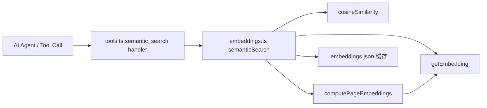
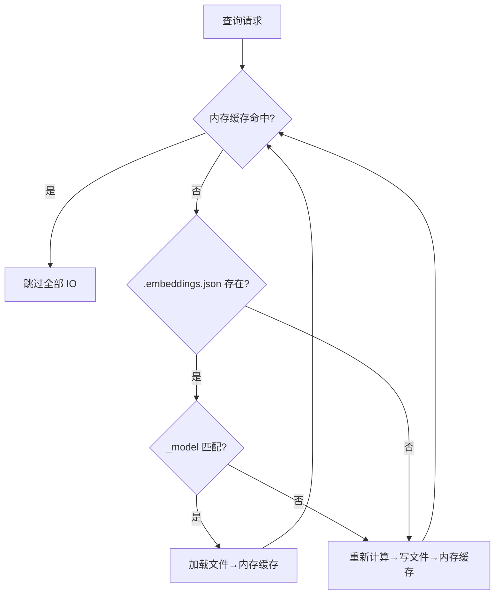

Now I have a complete picture. Let me write the page.

---

# 语义搜索实现

## 问题域

Wiki 文档达到一定规模后，关键词匹配的 `search_wiki` 工具会暴露出两个固有缺陷：同义词失效（搜"向量"找不到"embedding"）和语义鸿沟（"缓存策略"无法匹配"CacheData.\_model"）。**语义搜索** 通过将自然语言文本映射到高维向量空间，在余弦相似度下找到概念上最接近的页面，从根本上解决了这两个问题。

整个实现分布在三个模块中，形成一条清晰的调用链：



[来源](src/ai/tools.ts#L540-L555) | [来源](src/ai/embeddings.ts)

---

## 核心函数

### getEmbedding — 向量获取

这是与 Embedding API 交互的唯一入口。它接收文本和配置，构造标准的 OpenAI 兼容格式请求：

```typescript
const url = `${config.baseUrl.replace(/\/+$/, '')}/embeddings`;
const response = await fetch(url, {
  method: 'POST',
  headers: {
    'Content-Type': 'application/json',
    'Authorization': `Bearer ${config.apiKey}`,
  },
  body: JSON.stringify({ model: config.model, input: text }),
});
```

函数从 JSON 响应中提取 `result.data[0].embedding` 作为 `number[]` 返回。这是一个纯粹的异步 IO 函数，不维护任何状态，异常直接抛出而非静默吞掉（区别于上层调用者）。[来源](src/ai/embeddings.ts#L30-L47)

### cosineSimilarity — 相似度计算

一个教科书式的余弦相似度实现：

```typescript
function cosineSimilarity(a: number[], b: number[]): number {
  let dot = 0, na = 0, nb = 0;
  for (let i = 0; i < a.length; i++) {
    dot += a[i] * b[i];
    na += a[i] * a[i];
    nb += b[i] * b[i];
  }
  return dot / (Math.sqrt(na) * Math.sqrt(nb));
}
```

时间复杂度 O(n)，空间复杂度 O(1)。未对零向量做特殊处理（除零得到 `NaN`，但 Embedding API 产出的向量不会为零向量，这里走的是信任假设）。此函数**非导出**，仅在 `semanticSearch` 内部使用。[来源](src/ai/embeddings.ts#L20-L26)

### computePageEmbeddings — 批量索引

遍历 `pageFiles` 数组，逐个读取 Markdown 文件，取前 8000 字符作为 Embedding API 的输入：

```typescript
result[slug] = await getEmbedding(content.slice(0, 8000), config);
```

这个 **8000 字符的滑动窗口** 是刻意为之：主流 Embedding 模型（如 `text-embedding-3-small`）的上下文窗口通常是 8192 tokens，按中英文混合平均约 1 字符 ≈ 0.4 token 估算，8000 字符大致对应 3200 tokens，留有充足的余量。超过部分被截断，意味着超长文档只有开篇部分参与语义匹配。遇到读取或 API 错误时，**静默跳过**该页面（空的 `catch` 块）。[来源](src/ai/embeddings.ts#L50-L62)

---

## 三层缓存加速

`semanticSearch` 的核心逻辑围绕一个三级缓存策略展开，按速度优先级排列：



### 第一层：内存缓存

全局变量 `embeddingCache` 维护一个三元组 `{ data, model, wikiPath }`。命中条件：

```
embeddingCache.wikiPath === wikiPath && embeddingCache.model === config.model
```

三个字段**全等匹配**。路径或模型任一变更即视为失效。此缓存在 `clearEmbeddingCache()` 调用时显式重置（置为 `null`），适用于 Wiki 目录切换或模型切换的场景。[来源](src/ai/embeddings.ts#L18-L19) | [来源](src/ai/embeddings.ts#L85-L89) | [来源](src/ai/embeddings.ts#L137-L139)

### 第二层：文件缓存

缓存文件 `.embeddings.json` 存储在 Wiki 根目录下。其结构为：

```json
{
  "_model": "text-embedding-3-small",
  "_generated": "2025-01-15T10-30-45",
  "语义搜索实现": [0.0123, -0.0456, ...],
  "快速开始": [0.0789, -0.0123, ...]
}
```

- `_model`：记录生成此缓存所用的模型名称，用于模型变更检测。
- `_generated`：UTC 时间戳（以 `T` 分隔，`-` 替代 `:` 以避免 Windows 文件系统冲突）。
- 其余 key 为页面 slug，value 为 `number[]` 类型向量。

关键验证逻辑：检查 `parsed._model === config.model`。模型不同时，不会尝试复用缓存，而是直接重新计算并覆盖写入。解析时通过 **解构排除** `_model` 和 `_generated` 来获取 Embedding 字典：

```typescript
const { _model, _generated, ...embeddings } = parsed;
pageEmbs = embeddings as Record<string, number[]>;
```

缓存持久化函数 `saveCache` 为 **fire-and-forget**（try/catch 空块），写入失败不影响搜索结果。[来源](src/ai/embeddings.ts#L81-L112) | [来源](src/ai/embeddings.ts#L126-L136)

### 第三层：重新计算

当内存和文件缓存均失效时，调用 `computePageEmbeddings` 逐页调用 Embedding API 生成向量。这是最慢的路径（N 次网络请求），但对用户透明——结果会自动写回文件缓存和内存缓存，后续搜索直接走第一层。[来源](src/ai/embeddings.ts#L99-L101) | [来源](src/ai/embeddings.ts#L115)

---

## 调用链：从 Tool Definition 到语义搜索

### 1. 工具注册

`tools.ts` 中定义了 `semantic_search` 工具，描述为 *"Semantic search across Wiki using embeddings (if configured). Use when keyword search fails or for conceptual questions."*。[来源](src/ai/tools.ts#L181-L189)

### 2. 条件注入

Embedding 配置并非必需项。在 `ai.ts` 中，检查配置是否存在 Embedding 的 `model`、`baseUrl`、`apiKey` 三个字段，缺任何一个则从 `skipTools` 集合中排除 `semantic_search`，使其对 AI Agent 不可见。[来源](src/commands/ai.ts#L108-L115)

`initTools` 函数在运行时注入 Embedding 配置，供 `semantic_search` handler 使用。[来源](src/ai/tools.ts#L469-L477)

### 3. 动态导入

`semantic_search` handler 使用 `await import('./embeddings.js')` 延迟加载，避免启动时加载 Embedding 模块（用户可能没有配置 Embedding）：

```typescript
const { semanticSearch: doSearch } = await import('./embeddings.js');
const searchResults = await doSearch(query, wikiPath, embeddingConfig, mdFiles, maxResults || 5);
```

这种模式确保了未配置 Embedding 时，`embeddings.ts` 的依赖（如 `fetch`、`fs/promises`）不会被解析和加载。[来源](src/ai/tools.ts#L552-L553)

### 4. 结果装饰

原始 `SearchResult` 仅包含 `slug` 和 `score`。`tools.ts` 中的 handler 额外从 `index.json` 读取页面标题映射，将 `slug` 转换为可读的 `title`，并将浮点精度控制在小数点后 3 位。[来源](src/ai/tools.ts#L556-L570)

---

## 配置体系

Embedding 的配置项（`embeddingProvider`、`embeddingModel`、`embeddingBaseUrl`、`embeddingApiKey`）与 LLM 配置同层级存储在 `~/.wiki-cli/config.json` 中。`config-store.ts` 内置了 8 个预定义的 Embedding 模型，涵盖 OpenAI、Google Gemini、Cohere、Voyage AI、Jina AI、Mistral 等主流提供商。[来源](src/config/config-store.ts#L41-L52)

用户通过 `wiki-cli config --embedding-only` 进入专门配置流程，支持 preset 选择或自定义端点。[配置LLM](配置llm.md) 中的"仅配置 Embedding"模式即为此路径。

---

## 性能特征

| 缓存层级 | 延迟 | 触发条件 | 频次 |
|---------|------|---------|------|
| 内存缓存 | ~0ms | 同一 Wiki 目录+同一模型 | 会话内多次搜索 |
| 文件缓存 | ~5-50ms | 跨会话/进程首次搜索 | 每模型变更一次 |
| 重新计算 | N × ~200-500ms | 首次使用或模型变更 | 极低 |

N 为 Wiki 页面数。对于一个 50 页的 Wiki 使用 `text-embedding-3-small`，全量重新计算约需 10-25 秒。文件缓存写入约额外增加 1-5 MB 存储空间（取决于向量维度）。

---

## 下一步

- 深入理解 Embedding 配置的交互式流程 → [配置LLM](配置llm.md)
- 查看 `semantic_search` 作为 13 个工具之一的完整体系 → [工具系统与Function Calling](工具系统与function-calling.md)
- 了解 AI Agent 如何在对话中使用语义搜索 → [AI代码问答](ai代码问答.md)