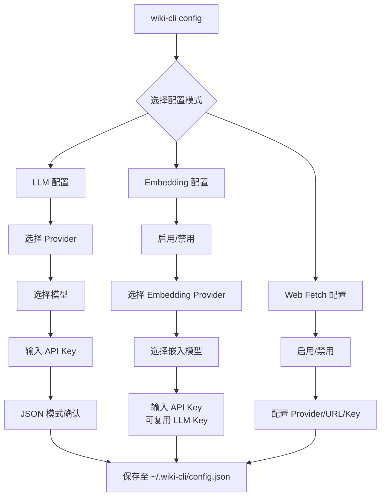

# 配置 LLM

`wiki-cli` 的所有 AI 能力——从 Wiki 文档生成到代码问答——都依赖一个核心配置：**LLM Provider** 的接入信息。配置系统通过交互式向导或命令行参数完成设置，结果持久化存储在用户主目录下。

## 配置架构全景

整个配置体系包含三个独立维度：



三种配置各自独立但又可以组合配置。第一次运行 `wiki-cli` 时，未配置的状态会触发引导提示。[来源](src/commands/config.ts#L16-L44)

## 交互式配置向导

`wiki-cli config` 命令启动交互式向导，这是最常用的配置方式。启动后首先出现菜单：

```
? What do you want to configure?
  LLM (provider / model / API key)
  Embedding (semantic search model)
  Web Fetch (let AI read documentation URLs)
  Both
  Done, quit
```

选中 **Both** 时，依次完成 LLM 和 Embedding 的配置；选中 **LLM** 或 **Embedding** 则只配置对应维度。首次配置选 **Both** 还会额外询问文档语言（`zh` 或 `en`）。[来源](src/commands/config.ts#L51-L80)

### 第一步：LLM Provider 与模型选择

选择 Provider 时，向导列出预置的所有供应商，末尾提供 **Custom（手动输入）** 选项。选中预设 Provider 后，再从其对应的模型列表中挑选具体模型——每个模型附带简要描述和定价提示，方便决策。

```typescript
// 预置模型数据结构
interface ModelEntry {
  provider: string;    // 供应商名称
  model: string;       // 模型标识
  baseUrl: string;     // API 端点
  description: string; // 模型描述
  pricingHint?: string; // 定价参考
}
```

[来源](src/config/config-store.ts#L38-L47)

目前预置了 **7 家供应商、21 个模型**：

| 供应商 | 代表性模型 | 端点 |
|---|---|---|
| OpenAI | gpt-5.5 / gpt-5.4-mini / gpt-5.4-nano | `https://api.openai.com/v1` |
| Google Gemini | gemini-3.1-pro / gemini-3-flash / gemini-3.1-flash-lite | `https://generativelanguage.googleapis.com/v1beta` |
| Anthropic | claude-opus-4-7 / claude-sonnet-4-6 / claude-haiku-4-5 | `https://api.anthropic.com/v1` |
| xAI Grok | grok-4.3 / grok-4.20-reasoning | `https://api.x.ai/v1` |
| DeepSeek | deepseek-v4-pro / deepseek-v4-flash | `https://api.deepseek.com` |
| Kimi (Moonshot) | kimi-k2.6 / kimi-k2.5 | `https://api.moonshot.cn/v1` |
| Mistral | mistral-large-3 / devstral-2 / ministral-14b | `https://api.mistral.ai/v1` |

[来源](src/config/default-models.json#L1-L199)

选择 **Custom** 时，需要手动输入 Base URL 和模型名称——这意味着你可以接入任何兼容 OpenAI API 格式的服务，包括本地部署的 Ollama、vLLM 或其他兼容 API 代理。[来源](src/commands/config.ts#L101-L107)

### 第二步：JSON 模式确认

选定模型后，系统自动判断该 Provider 是否支持 **JSON output mode**（结构化输出）。已知支持的供应商自动确认，Custom 供应商则会弹出询问：

```
? Does this provider support JSON output mode? (Y/n)
```

JSON 模式用于生成引擎中的结构化数据提取场景。[来源](src/config/config-store.ts#L69-L72)

### 第三步：Embedding 模型配置

**Embedding 模型**用于[语义搜索实现](语义搜索实现.md)——将 Wiki 页面向量化后支持自然语言检索。与 LLM 配置类似，选中启用后从预置列表选择：

| 供应商 | 模型 | 维度 | 适用场景 |
|---|---|---|---|
| OpenAI | text-embedding-3-large | 3072 | 最佳通用 |
| OpenAI | text-embedding-3-small | 1536 | 日常 RAG 首选 |
| Google Gemini | gemini-embedding-2 | 3072 | MTEB 领先 |
| Cohere | embed-v4 | 4096 | 100+ 语言 |
| Voyage AI | voyage-4-large | 2048 | 代码/技术文档最佳 |
| Jina AI | jina-embeddings-v3 | 1024 | 长上下文/多语言 |
| Mistral | mistral-embed | 1024 | Mistral 官方 |

[来源](src/config/config-store.ts#L49-L66)

API Key 支持复用 LLM 的 Key（留空即可），也可以单独指定——这在你使用不同厂商的 Embedding 服务时很有用。[来源](src/commands/config.ts#L169-L171)

### 第四步：Web Fetch 配置

**Web Fetch** 服务让 AI 在生成文档或回答问题时能够实时读取在线文档（通过 Jina Reader 转换 URL 内容为 Markdown）。配置项包括：

- **Provider**：默认为 `jina`
- **Base URL**：默认为 `https://r.jina.ai`
- **API Key**：可选，免费额度可用留空，填写可提升速率限制

禁用 Web Fetch 后，AI 将无法访问外部 URL，只能基于本地代码库和已生成的 Wiki 内容工作。[来源](src/commands/config.ts#L177-L209)

## 非交互式配置

跳过交互式向导直接配置，适用于 CI/CD 或脚本场景：

```bash
wiki-cli config \
  --provider OpenAI \
  --base-url https://api.openai.com/v1 \
  --model gpt-5.4-mini \
  --api-key sk-xxx
```

可选参数还包括：

- `--lang zh/en` — 设置文档语言
- `--llm-only` — 只配置 LLM，跳过 Embedding
- `--embedding-only` — 只配置 Embedding

非交互模式下不涉及 Web Fetch 配置。[来源](src/cli.ts#L27-L40)

## 配置持久化

所有配置以 JSON 格式保存在 `~/.wiki-cli/config.json`。配置文件结构如下：

```typescript
interface WikiCliConfig {
  provider: string;           // LLM 供应商
  baseUrl: string;            // LLM API 端点
  model: string;              // LLM 模型名
  apiKey: string;             // LLM API 密钥
  lang: string;               // 文档语言 (zh/en)
  jsonMode?: boolean;         // 是否支持 JSON 模式
  
  embeddingProvider?: string; // Embedding 供应商
  embeddingModel?: string;    // Embedding 模型
  embeddingBaseUrl?: string;  // Embedding API 端点
  embeddingApiKey?: string;   // Embedding API 密钥
  
  webFetchDisabled?: boolean; // 是否禁用 Web Fetch
  webFetchProvider?: string;  // Web Fetch 供应商
  webFetchBaseUrl?: string;   // Web Fetch 端点
  webFetchApiKey?: string;    // Web Fetch API 密钥
}
```

配置目录和文件在首次保存时自动创建，无需手动初始化。[来源](src/config/config-store.ts#L80-L95)

## 配置的消费方

配置写好后，会被以下子系统读取使用：

- **[LLM客户端设计](llm客户端设计.md)** — 读取 `provider`/`baseUrl`/`model`/`apiKey` 构建 API 请求，`jsonMode` 控制 `response_format` 设置。[来源](src/ai/llm-client.ts#L55-L68)
- **[语义搜索实现](语义搜索实现.md)** — 读取 `embeddingProvider`/`embeddingModel`/`embeddingBaseUrl`/`embeddingApiKey` 调用 Embedding API。[来源](src/ai/embeddings.ts#L29-L43)
- **[AI会话管理系统](ai会话管理系统.md)** — 加载配置中的 LLM 信息初始化会话。[来源](src/commands/ai.ts)
- **[生成wiki文档](生成wiki文档.md)** — 生成过程中需要 LLM 和 Web Fetch 配置。[来源](src/commands/generate.ts)

## 下一步

- 配置完成后，通过 [快速开始](快速开始.md) 体验完整的生成→浏览流程
- 进阶用户可深入了解 [LLM客户端设计](llm客户端设计.md) 了解重试策略、流式处理等实现细节
- 如需管理多套配置，可参考 [配置持久化](配置持久化.md) 了解配置文件的完整读写机制