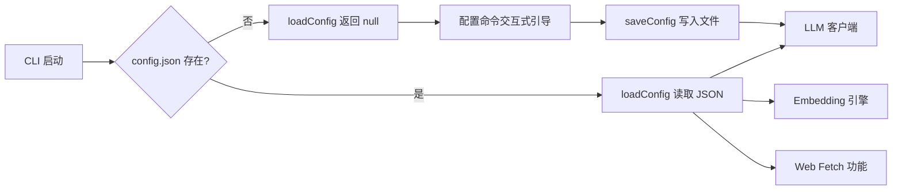

# 配置持久化

配置文件是 wiki-cli 所有功能的起点。没有它，[生成Wiki文档](生成wiki文档.md)、[AI代码问答](ai代码问答.md)和[语义搜索](语义搜索实现.md)等核心能力都无法运转。本文深入到 `src/config/config-store.ts` 的内部，解析配置的结构、读写机制以及模型注册表的设计。

## 三重配置：LLM、Embedding、WebFetch

`WikiCliConfig` 接口定义了完整的用户配置，覆盖三个独立的服务维度：

**LLM 配置**是文档生成和 AI 问答的核心驱动。`provider`、`model`、`baseUrl`、`apiKey` 四个字段决定了哪个大语言模型来处理你的任务。`jsonMode` 控制是否启用 JSON 结构化输出——这对[工具调用接口](工具调用接口.md)的正常工作至关重要。`lang` 字段则标注目标文档语言（`zh` 或 `en`）。

**Embedding 配置**服务于[语义搜索](语义搜索实现.md)。`embeddingProvider`、`embeddingModel`、`embeddingBaseUrl`、`embeddingApiKey` 四个可选字段构成独立的嵌入通道。如果 `embeddingApiKey` 留空，系统会自动复用 LLM 的 `apiKey`，减少重复输入。

**WebFetch 配置**允许 AI 在对话中读取在线文档。`webFetchProvider` 默认使用 Jina Reader（`https://r.jina.ai`），`webFetchBaseUrl` 和 `webFetchApiKey` 分别配置服务端点和认证信息。通过 `webFetchDisabled` 可一键关闭此功能。

```typescript
export interface WikiCliConfig {
  provider: string;
  baseUrl: string;
  model: string;
  apiKey: string;
  lang: string;
  jsonMode?: boolean;
  embeddingProvider?: string;
  embeddingModel?: string;
  embeddingBaseUrl?: string;
  embeddingApiKey?: string;
  webFetchDisabled?: boolean;
  webFetchProvider?: string;
  webFetchBaseUrl?: string;
  webFetchApiKey?: string;
}
```

[来源](src/config/config-store.ts#L7-L21)

## 文件路径与存储格式

配置文件存储在用户主目录下的固定位置。`CONFIG_DIR` 指向 `~/.wiki-cli`，`CONFIG_PATH` 指向该目录下的 `config.json`。这种设计使配置与任何特定项目解耦——无论你在哪个仓库下运行 `wiki-cli`，配置都全局生效。

```typescript
const CONFIG_DIR = join(homedir(), '.wiki-cli');
const CONFIG_PATH = join(CONFIG_DIR, 'config.json');
```

[来源](src/config/config-store.ts#L63-L64)

## 异步读写：loadConfig 与 saveConfig

配置文件的读写通过两个异步函数完成：

`loadConfig` 首先检查文件是否存在，不存在则返回 `null`——这对应首次运行时的逻辑，[配置LLM](配置llm.md) 命令会在检测到 `null` 后引导用户逐步完成设置。文件存在时，以 UTF-8 读取并解析为 `WikiCliConfig` 对象。任何读取或解析异常都被静默捕获，同样返回 `null`，保证失败时的优雅降级。

`saveConfig` 则先递归创建配置目录（`mkdir` 的 `recursive: true` 确保目录链完整），再将配置对象格式化为缩进 2 空格的 JSON 写入文件。这种格式化使人眼可直接阅读和编辑 `~/.wiki-cli/config.json`。

```typescript
export async function loadConfig(): Promise<WikiCliConfig | null> {
  try {
    if (!existsSync(CONFIG_PATH)) return null;
    const raw = await readFile(CONFIG_PATH, 'utf-8');
    return JSON.parse(raw) as WikiCliConfig;
  } catch {
    return null;
  }
}

export async function saveConfig(config: WikiCliConfig): Promise<void> {
  await mkdir(CONFIG_DIR, { recursive: true });
  await writeFile(CONFIG_PATH, JSON.stringify(config, null, 2), 'utf-8');
}
```

[来源](src/config/config-store.ts#L77-L90)

在整个代码库中，`loadConfig` 被四个命令模块共同引用：[配置LLM](配置llm.md) 的命令 `src/commands/config.ts`、[生成Wiki文档](生成wiki文档.md) 的 `src/commands/generate.ts`、[AI代码问答](ai代码问答.md) 的 `src/commands/ai.ts`，以及[工具调用接口](工具调用接口.md) 的 `src/commands/tool-call.ts`。`saveConfig` 则只在配置命令中调用，因为其余功能只读不写。[来源](src/commands/config.ts#L2-L3)

## JSON 模式白名单

并非所有 Provider 都支持 JSON 结构化输出。`JSON_MODE_PROVIDERS` 是一个硬编码的 `Set`，列出已知支持的厂商：`OpenAI`、`DeepSeek`、`xAI Grok`、`Mistral` 和 `Kimi (Moonshot)`。

```typescript
const JSON_MODE_PROVIDERS = new Set([
  'OpenAI',
  'DeepSeek',
  'xAI Grok',
  'Mistral',
  'Kimi (Moonshot)',
]);
```

辅助函数 `supportsJsonMode(provider)` 的返回值有三种含义：`true` 表示白名单内的已知支持者；`false` 表示已知不支持；当 `provider === 'Custom'` 时返回 `undefined`，触发交互式询问，让用户自行判断。[来源](src/config/config-store.ts#L53-L61)

## 默认模型注册表

项目中包含两个模型注册表，分别管理 LLM 模型和 Embedding 模型。

### default-models.json：LLM 模型清单

这是一个包含 21 个条目的 JSON 数组，覆盖七家主流厂商：OpenAI、Google Gemini、Anthropic、xAI Grok、DeepSeek、Kimi (Moonshot) 和 Mistral。每家厂商提供 2-5 个模型，从旗舰级到经济型不等。每个条目包含五个字段：

```typescript
export interface ModelEntry {
  provider: string;
  model: string;
  baseUrl: string;
  description: string;
  pricingHint?: string;
}
```

`pricingHint` 字段是纯文字提示（如 `"Most expensive, highest quality"`、`"Fast, low cost"`），帮助用户在交互式配置中快速决策。[来源](src/config/default-models.json)

### EMBEDDING_MODELS：内嵌的嵌入模型清单

与 LLM 模型的 JSON 文件方式不同，嵌入模型以 TypeScript 常量 `EMBEDDING_MODELS` 的形式直接在 `config-store.ts` 中定义。这是因为嵌入模型数量更少且变化频率更低。每个条目除基础信息外，还多出一个 **`dimensions`** 字段——它决定了语义向量的维度，直接衡量搜索精度和存储开销。

| 厂商 | 模型 | 维度 | 定价参考 |
|------|------|------|----------|
| OpenAI | text-embedding-3-large | 3072 | ~$0.13/MT |
| OpenAI | text-embedding-3-small | 1536 | ~$0.02/MT |
| Google Gemini | gemini-embedding-2 | 3072 | ~$0.006-0.15/MT |
| Cohere | embed-v4 | 4096 | ~$0.10/MT |
| Voyage AI | voyage-4-large | 2048 | ~$0.12/MT |
| Jina AI | jina-embeddings-v3 | 1024 | ~$0.02/MT |
| Mistral | mistral-embed | 1024 | ~$0.10/MT |

[来源](src/config/config-store.ts#L33-L62)

## 查询函数：按提供商筛选模型

两个注册表提供了对称的查询接口：

```typescript
// LLM 模型
export function getProviders(models: ModelEntry[]): string[]
export function getModelsByProvider(models: ModelEntry[], provider: string): ModelEntry[]

// Embedding 模型
export function getEmbeddingProviders(): string[]
export function getEmbeddingModelsByProvider(provider: string): EmbeddingModelEntry[]
```

`getProviders` 从模型数组中提取去重后的厂商列表，`getModelsByProvider` 则按厂商名过滤。前者构建配置交互中的第一级选择菜单，后者提供第二级模型选择。[来源](src/config/config-store.ts#L97-L111)

单元测试 `tests/config-store.test.ts` 验证了这些函数的核心行为：20+ 条目的完整性、所有必选字段的存在性、七家厂商的覆盖、以及 `getModelsByProvider` 的过滤正确性。[来源](tests/config-store.test.ts)

## 扩展性：Custom Provider

系统为超出预定义厂商列表的场景预留了入口。在交互式配置中，选择 `"✏️ Custom (enter manually)"` 会将 `provider` 设置为 `"Custom"`，然后由用户自行输入 `baseUrl` 和 `model`。这一机制在 LLM 配置和 Embedding 配置中同时存在。[来源](src/commands/config.ts#L96-L107)

对于 Custom Provider 的 `jsonMode`，`supportsJsonMode('Custom')` 返回 `undefined`，配置命令会弹出一个确认询问，由用户自行决定。这种设计使系统能接入任何兼容 OpenAI API 格式的服务，无论是私有部署的本地模型还是新兴的第三方 API。[来源](src/commands/config.ts#L118-L124)

## 配置的生命周期

下图展示配置从创建到被各模块消费的完整路径：



[`loadConfig` 来源](src/config/config-store.ts#L77-L84) | [`saveConfig` 来源](src/config/config-store.ts#L86-L90)

## 下一步

- 了解如何通过交互式命令**配置**各 Provider：[配置LLM](配置llm.md)
- 查看**LLM 客户端**如何使用 `WikiCliConfig` 构建 API 请求：[LLM客户端设计](llm客户端设计.md)
- 深入了解**Embedding 引擎**如何消费配置执行语义搜索：[语义搜索实现](语义搜索实现.md)