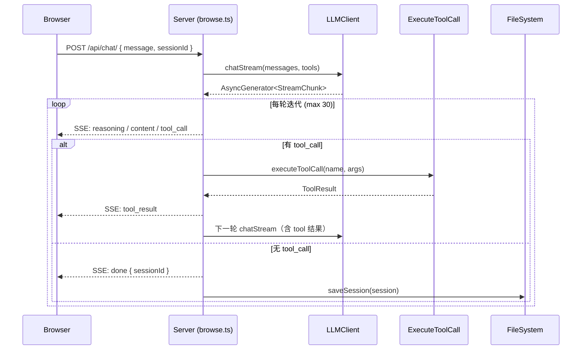

# AI 聊天面板：浏览器内对话

当 `wiki-cli browse` 启动内置 HTTP 服务器后，页面右侧会出现一个可折叠的 AI 聊天面板。它不与任何独立的 LLM 终端会话共享进程，却复用同一套工具链、客户端和会话存储——理解这个面板，就等于理解了 wiki-cli 如何将**终端中的流式对话**移植到**浏览器 DOM 中**。

---

## 架构总览

聊天面板的通信是典型的**服务端推送**模式：



Panel 并非 WebSocket，而是基于 **HTTP 长连接 + SSE**（Server-Sent Events）。浏览器通过标准 `fetch()` 发起 POST，服务端以 `text/event-stream` 持续写入事件行。每个事件的格式是固定的单行 JSON：`data: { "type": "...", ... }\n\n`。

[来源](src/commands/browse.ts#L137-L230)

---

## SSE 事件协议

服务端在 POST /api/chat/ 处理器内部维护了一个 `maxIterations = 30` 的 Tool-augmented 循环。每次循环中，它调用 `chatClient.chatStream()` 获取 LLM 的流式输出块，然后将每个块转换为 SSE 事件推送至浏览器。整个过程由五种事件类型覆盖：

| 事件类型 | 方向 | 载荷 | 触发时机 |
|---|---|---|---|
| `reasoning` | 服务端 → 浏览器 | `{ text: string }` | LLM 返回 `reasoning_content` 块（深度思考模型） |
| `content` | 服务端 → 浏览器 | `{ text: string }` | LLM 返回可见文本块 |
| `tool_call` | 服务端 → 浏览器 | `{ name, args }` | LLM 请求调用某个工具 |
| `tool_result` | 服务端 → 浏览器 | `{ name, summary }` | 工具执行完成，summary 取前 120 字符 |
| `done` | 服务端 → 浏览器 | `{ sessionId }` | 整轮对话结束（含多轮 tool 调用） |
| `error` | 服务端 → 浏览器 | `{ text }` | API 错误或流读取异常 |

关键细节：

- **tool_call 的累积**：LLM 的流式 tool_call 可能分多次返回（同一调用 ID 的 `arguments` 被切分）。服务端使用 `Map<string, ToolCall>` 按 `index` 或 `id` 合并，待流结束后才统一执行 `executeToolCall`。
- **tool_result 的摘要**：工具结果只截取前 120 字符推送到前端，完整结果（`JSON.stringify(result)`）被追加到 `allMessages` 中送入下一轮 LLM 调用。
- **会话保存时机**：`done` 事件发送前，服务端已将 `allMessages.slice(1)` 写回磁盘，同时更新 `session.summary`。

[来源](src/commands/browse.ts#L155-L225)

---

## 浏览器端：SSE 接收与渲染

浏览器端没有使用 `EventSource` API——因为 SSE 需要通过 POST 发送消息体，而 `EventSource` 只支持 GET。因此前端采用 **fetch + ReadableStream** 手动解析：

```javascript
const res = await fetch('/api/chat/', { method: 'POST', body: JSON.stringify({ message, sessionId }) });
const reader = res.body.getReader();
const decoder = new TextDecoder();
let buffer = '';

while (true) {
  const { done, value } = await reader.read();
  if (done) break;
  buffer += decoder.decode(value, { stream: true });
  const lines = buffer.split('\n');
  buffer = lines.pop() || '';
  for (const line of lines) {
    if (!line.startsWith('data: ')) continue;
    const data = JSON.parse(line.slice(6));
    // dispatch by data.type
  }
}
```

解析出的每个事件被分派到对应的 DOM 操作：

### reasoning 事件

创建一个 `div.chat-msg.reasoning` 元素，通过 `textContent` 追加文本。该元素显示为灰色斜体，符合"思考过程"的视觉暗示：

```css
.chat-msg.reasoning { font-style: italic; color: #8b949e; font-size: 12px; align-self: flex-start; }
```

### content 事件

通过 `marked.parse(currentContent)` **增量渲染 Markdown**。这里的关键模式是：每次收到新的 content 块，将已累积的完整文本传给 `marked.parse()`，再用 `innerHTML` 替换 DOM 内容。这意味着 `<code>` 块、`<pre>`、`<ul>` 等结构会在每次更新时完整重建。

```css
.chat-msg.assistant { background: #0d1117; border: 1px solid #30363d; align-self: flex-start; }
.chat-msg pre { background: #0d1117; padding: 8px; border-radius: 4px; overflow-x: auto; }
.chat-msg code { background: #1c2333; padding: 1px 4px; border-radius: 3px; }
```

### tool_call 事件

重置 reasoning/content 累积状态（为下一轮 LLM 响应做准备），新增一个 `div.chat-msg.tool`，显示工具名称和截断的参数：

```css
.chat-msg.tool { font-size: 12px; color: #58a6ff; align-self: flex-start; font-family: monospace; }
```

### tool_result 事件

新增 `div.chat-msg.tool-result`，显示工具名称和结果摘要（前 100 字符）：

```css
.chat-msg.tool-result { font-size: 11px; color: #8b949e; align-self: flex-start; }
```

### done 事件

更新全局 `chatSessionId` 并写入 `localStorage`，这样页面刷新后能自动恢复会话。

[来源](src/commands/browse.ts#L790-L895)

---

## 会话恢复与持久化

面板启动时，从 `localStorage` 读取 `wikiChatSessionId`，如果存在则通过 `GET /api/chat/?session=<id>` 加载历史消息：

1. **服务端**：`loadSession(sessionId)` 读取磁盘上的 `.wiki/sessions/<id>.json` 文件。
2. **浏览器端**：遍历 `session.messages`，区分 `user`、`assistant`（含 `reasoning_content`、`tool_calls`、`content`）角色重建 DOM。

```javascript
if (chatSessionId) {
  fetch('/api/chat/?session=' + chatSessionId)
    .then(r => r.json())
    .then(session => {
      for (const m of session.messages) {
        // 按角色重建 DOM 元素
      }
    });
}
```

[来源](src/commands/browse.ts#L899-L950)

---

## 与独立 `ai` 命令的异同

[AI 问答](ai-问答.md) 命令（`wiki-cli ai`）与浏览器内聊天面板共享几乎相同的核心管道，但呈现方式和交互模型存在本质差异：

| 维度 | 独立 ai 命令 | 浏览器聊天面板 |
|---|---|---|
| **流式输出** | `process.stdout.write()` 逐 chunk 写入终端 | SSE → `innerHTML` 增量渲染 Markdown |
| **Markdown 渲染** | 终端中显示原始文本，不渲染 | `marked.parse()` 渲染为 HTML |
| **工具调用反馈** | 终端打印 `[Using tool: xxx]` 日志 | 面板内显示 tool_call / tool_result 气泡 |
| **斜杠命令** | `/help`, `/save`, `/clear`, `/session`, `/switch`, `/new`, `/wiki`, `/undo` | `/help`, `/new`, `/undo`, `/session`（浏览器专用子集） |
| **会话管理** | `setSessionsDir(workDir)` 指定工作目录 | 默认使用 `process.cwd()` 的 `.wiki/sessions/` |
| **迭代上限** | 50 轮 | 30 轮 |
| **取消机制** | `SIGINT` 信号驱动 `isCancelled` | 前端通过 `isStreaming` 标记禁止重复提交 |
| **聊天状态保持** | 终端关闭后丢失，依赖 `--session` 恢复 | `localStorage` 持久化 sessionId，刷新后自动恢复 |

**共享的代码模块**：

- `LLMClient.chatStream()` — 两处使用的都是同一流式解析逻辑，见 [LLM 客户端：流式与非流式](llm-客户端-流式与非流式.md)
- `executeToolCall()` — 同一 13 工具调度表，见 [Tool 系统：定义与执行](tool-系统-定义与执行.md)
- `createSession / loadSession / saveSession` — 同一会话 CRUD，见 [会话管理系统](会话管理系统.md)
- `renderPrompt('ai-system.md', ...)` — 同一 Prompt 模板渲染，见 [Prompt 模板系统](prompt-模板系统.md)

最根本的区别在于：`ai` 命令在同一个 Node.js 进程中完成全部 I/O，而浏览面板将 I/O 边界推到了 HTTP 层——服务端只负责流式翻译（SSE 编码），渲染和交互全部交给浏览器 DOM。

[来源](src/commands/ai.ts#L1-L300) | [来源](src/commands/browse.ts#L137-L230)

---

## 关键设计决策

### 为什么不用 WebSocket？

SSE 基于 **HTTP 长连接**，无需额外握手协议，与现有 HTTP 服务器共享端口。对于纯服务端→客户端的单向流（LLM 推理内容流），SSE 的 `data: JSON\n\n` 格式足够且简单。双向通信的需求仅存在于"发送用户消息"阶段，这已由标准 POST 覆盖。

### 为什么 tool_call 和 tool_result 要拆成两个事件？

这是为了给用户**可视化的工具执行反馈**。如果等工具执行完才一次性推送，用户会看到长时间的空白等待。拆分为两事件后，tool_call 让用户知道"AI 正在读文件"，tool_result 让用户看到结果摘要，形成完整的操作轨迹。

### 为什么浏览器端每次都用 `marked.parse(currentContent)` 全量重渲染？

流式场景下，LLM 的内容片段可能是"中间位置"的（例如一个 `<table>` 或 `<code>` 块中间）。增量追加文本到 DOM 会导致格式错乱。全量重渲染虽不够高效，但保证了 Markdown 结构的完整性——这在内容长度有限的聊天场景中是可接受的权衡。

[来源](src/commands/browse.ts#L170-L185) | [来源](src/commands/browse.ts#L826-L835)

---

## 下一步

- 了解聊天面板引用的底层流式客户端：[LLM 客户端：流式与非流式](llm-客户端-流式与非流式.md)
- 查看面板可调用的全部 13 个工具：[Tool 系统：定义与执行](tool-系统-定义与执行.md)
- 对比终端交互模式：[AI 问答](ai-问答.md)
- 理解会话文件在磁盘上的存储结构：[会话管理系统](会话管理系统.md)