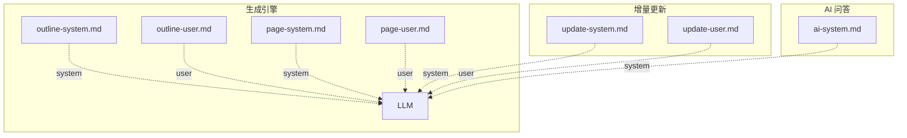

# Prompt 模板系统

**代码与 Prompt 的分离**是 wiki-cli 的核心设计决策之一。所有 AI 对话的指令（System Prompt）和用户上下文（User Prompt）都以独立的 Markdown 文件存放在 `prompts/` 目录中，通过一个轻量渲染引擎在运行时完成变量替换。这套系统让 Prompt 的维护、修改和调试无需触碰 TypeScript 代码。

---

## 渲染引擎：两步流程

整个模板系统的入口是 `renderPrompt` 函数，它由两个更原子的操作串联而成：

```
renderPrompt(filename, vars)
    ├─ ① loadPrompt(filename)  → 读取 prompts/ 下的 .md 文件为字符串
    └─ ② fillPrompt(template, vars)  → 用正则替换所有 {{var}} 占位符
```

**`loadPrompt`** 接收文件名（如 `outline-system.md`），拼接 `prompts/` 目录的绝对路径后以 UTF-8 读取文件。路径通过 `__dirname` 计算，无论从哪个工作目录启动 CLI 都能正确找到模板文件。 [来源](src/ai/prompts.ts#L14-L17)

**`fillPrompt`** 遍历 `vars` 对象的每个键值对，用全局正则 `/\{\{key\}\}/g` 扫描模板并将所有匹配替换为对应的值。未匹配的 `{{var}}` 保留原样，以避免静默吞掉遗漏的占位符。 [来源](src/ai/prompts.ts#L19-L25)

```typescript
// 使用示例
const systemPrompt = await renderPrompt('outline-system.md', {
  workDir: '/path/to/repo',
  os: 'win32 x64'
});
```

[来源](src/ai/prompts.ts#L27-L30)

组合后的 **`renderPrompt`** 是外部模块唯一调用的高层函数。它异步完成文件读取和替换，返回最终字符串作为 LLM 消息的内容。 [来源](src/ai/prompts.ts#L27-L30)

---

## 七个 Prompt 的角色图谱

`prompts/` 目录下共有 7 个文件，按功能分为三组：大纲生成、页面撰写、增量更新，外加一个独立的 AI 问答系统指令。



### 大纲生成组

#### `outline-system.md` — 大纲生成指令 + 分析框架

赋予 LLM **"资深软件工程师兼技术文档专家"** 的角色。它定义了一个四步分析框架：① 高层愿景与价值 → ② 架构深度剖析 → ③ 受众分析 → ④ 生成 JSON 格式目录。框架要求输出严格的 JSON 结构（包含 `入门指南` 和 `深入探索` 两节，每 topic 带 `description` 和 `task` 字段）。此 Prompt 不注入任何项目特定数据，它通过 Tool Calling 让 LLM 自主探索仓库。 [来源](prompts/outline-system.md)

#### `outline-user.md` — 仓库信息注入

作为 User Message 提供仓库环境信息（工作目录、操作系统、语言）。它告诉 LLM "使用工具探索项目布局"，然后按照系统提示中的框架分析并输出 JSON。相比 System Prompt 的通用指令，这里只携带最小上下文：`{{workDir}}`、`{{os}}`、`{{lang}}`。 [来源](prompts/outline-user.md)

这两个 Prompt 在 `generateOutline` 函数中组装为 `[system, user]` 消息数组，然后以 JSON 模式发送给 LLM。 [来源](src/commands/generate.ts#L292-L296)

---

### 页面撰写组

#### `page-system.md` — 页面写作规范 + Diátaxis 框架

定义 wiki-cli 作者角色的行为准则：从代码中提炼设计意图、遵循 **第一性原理**（先抓核心逻辑再展开细节）、使用 **Diátaxis 框架** 组织内容。它还规定了叙事节奏（吸引 → 兴趣 → 欲望 → 行动）、视觉规范（Mermaid 图表、表格、粗体标注）、证据标准（每段末尾标注来源，路径必须从项目根开始）、以及交叉引用规则。 [来源](prompts/page-system.md)

#### `page-user.md` — 页面任务 + 旧内容注入

这是最复杂的 User Prompt。它接收一个包含 `pageTitle`、`audienceLevel`、`pageSlug`、`pageTask`、`oldContent`、`changeTrigger`、`availablePages` 等 10 余个变量的元数据块。关键变量包括：

| 变量 | 用途 |
|------|------|
| `{{pageTask}}` | 从目录携带的 per-page 写作指令 |
| `{{oldContent}}` | 页面旧版本全文（用于增量更新） |
| `{{changeTrigger}}` | 触发页面更新的代码变更摘要 |
| `{{availablePages}}` | 所有其他 Wiki 页面的 slug 列表，供交叉引用 |

这些变量在 `generatePage` 函数中逐一填充，然后与 `page-system.md` 组合为 LLM 消息。 [来源](src/commands/generate.ts#L740-L755)

---

### 增量更新组

#### `update-system.md` — 增量更新判断规则

赋予 LLM **"Wiki 维护者"** 角色。它定义了五种判断动作：`update`、`remove`、`add`、`restructure`，并给出每条规则的适用条件（如纯注释修改不改语义则不更新）。输出必须是严格的 JSON 对象，含 `action`、`update`、`add`、`remove`、`_reason` 字段。 [来源](prompts/update-system.md)

#### `update-user.md` — 变更数据注入

将实际的 Git diff 分析结果注入给 LLM，包括：
- `{{changedSummary}}`：变更文件列表及影响的页面
- `{{candidatesInfo}}`：候选页面的文件行号依赖
- `{{pageContents}}`：候选页面的旧版本全文
- `{{newFiles}}`：新增文件列表

这些数据在 `evaluateUpdate` 函数中通过 [Git 差异分析与依赖追踪](git-差异分析与依赖追踪.md) 系统计算得出。 [来源](src/commands/generate.ts#L366-L401)

---

### AI 问答组

#### `ai-system.md` — 问答行为准则 + 工具列表

用于交互式 AI 问答场景（`wiki ai` 命令和浏览器内聊天面板）。定义 LLM 的角色是 **"资深代码分析师"**，行为准则包括：优先读 Wiki 获取全貌、答案简洁结构化、标注来源路径必须从项目根开始。它还动态注入 Wiki 工具列表（`list_wiki_pages`、`read_wiki`）和源码探索工具（`list_directory`、`read_file`、`search_in_files` 等）。 [来源](prompts/ai-system.md)

这个 Prompt 在两个地方被调用：
- `ai.ts` 中构建系统提示用于 CLI 问答 [来源](src/commands/ai.ts#L141)
- `browse.ts` 中构建系统提示用于浏览器内聊天面板 [来源](src/commands/browse.ts#L108)

---

## 设计考量

**模板与代码分离**带来几个实际好处：

1. **独立迭代**：Prompt 的措辞调整只需修改 `.md` 文件，无需重新编译 TypeScript，降低 AI 工程师与后端工程师的协作摩擦。
2. **可测试性**：`fillPrompt` 是纯函数，7 个测试用例覆盖了单变量替换、多变量替换、同一变量多处替换、未匹配变量保留等边界场景。 [来源](tests/prompts.test.ts#L1-L44)
3. **版本追踪**：所有 Prompt 变更都记录在 Git 历史中，回滚和 diff 与代码同等处理。

更值得注意的是变量的粒度设计：System Prompt 几乎不含变量（只有 `workDir` 和 `os`），而 User Prompt 承载了大量动态数据。这符合 **System Prompt 固化行为、User Prompt 注入上下文** 的最佳实践。

---

## 下一步

- 了解两阶段生成引擎如何使用这些 Prompt：[两阶段生成引擎](两阶段生成引擎.md)
- 深入增量更新流程中 Prompt 如何与依赖数据交互：[增量更新：--update 模式](增量更新-update-模式.md)
- 查看 AI 问答会话如何加载 system prompt：[会话管理系统](会话管理系统.md)