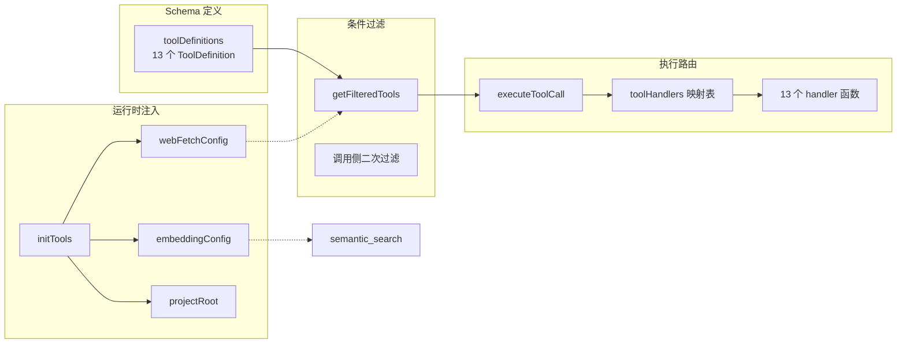

# Tool 系统：定义与执行

wiki-cli 为 AI Agent 暴露了 **13 个只读工具**，覆盖文件系统探查、Git 历史查询、Wiki 文档检索和网络获取四大能力域。这套工具系统的核心设计由三层构成：**Schema 定义**（告诉 LLM 可用什么）、**运行时注入**（配置敏感信息）、**条件过滤**（按环境裁剪可见工具）。

## 架构总览



`toolDefinitions` 数组是 LLM 的"菜单"——每个条目遵循 OpenAI Function Calling 规范，包含 `name`、`description` 和 `parameters`（JSON Schema）。[来源](src/ai/tools.ts#L1-L16)

## 13 个工具的 Schema 定义

所有工具共享 `ToolDefinition` 接口：`type: 'function'` + 嵌套的 `function` 对象。[来源](src/ai/tools.ts#L10-L16)

| 工具名 | 必需参数 | 可选参数 | 用途 |
|---|---|---|---|
| `list_directory` | `dir_path` | `max_depth` (默认 3) | 递归目录树 |
| `list_files` | `path` | `extensions` (扩展名过滤) | 扁平文件列表 |
| `read_file` | `file_path` | `start_line`, `end_line` | 读取文件内容 |
| `search_in_files` | `path`, `pattern` | `extensions` | 正则搜索 |
| `git_log` | 无 | `max_count`, `path` | 提交历史 |
| `git_show` | `object` | `path` | Git 对象详情 |
| `git_remote_info` | 无 | — | 远程仓库信息 |
| `dotenv_template` | 无 | — | 读取 .env.example |
| `list_wiki_pages` | 无 | — | 列出所有 Wiki 页面 |
| `read_wiki` | `slug` | — | 按 slug 读取 Wiki 页面 |
| `search_wiki` | `query` | `max_results` (默认 5) | 关键词搜索 Wiki |
| `semantic_search` | `query` | `max_results` (默认 5) | 语义搜索 Wiki |
| `fetch_web_markdown` | `url` | — | 获取 URL 并转为 Markdown |

前 8 个工具面向**代码仓库操作**，后 5 个面向**Wiki 文档检索**。`fetch_web_markdown` 是唯一跨越边界的工具——它从 Web 获取外部文档。[来源](src/ai/tools.ts#L20-L152)

## Handler 实现细节

### 文件系统工具

**`listDirectory`** 递归构建目录树。核心函数 `buildTree` 接受 `root`、`current`、`depth`、`maxDepth` 四个参数，在深度超过 `maxDepth` 时返回 `{ name: '...', type: 'truncated' }`。遍历时自动跳过 `.` 开头的条目和 `node_modules`。[来源](src/ai/tools.ts#L158-L175)

**`listFiles`** 提供扁平化递归搜索，通过 `extname` 匹配扩展名过滤。返回绝对路径数组。[来源](src/ai/tools.ts#L184-L206)

**`readFileTool`** 实现了行范围截断加字符上限的双重保护机制。常量 `MAX_FILE_CHARS = 30000` 作为硬性截断线。当文件超过此限制时，返回截断内容并附上中文提示信息，指明当前行范围和继续读取需要的 `start_line` 参数值，引导 LLM 分批次读取。[来源](src/ai/tools.ts#L211-L248)

**`searchInFiles`** 用 `new RegExp(pattern, 'i')` 创建大小写不敏感的正则，逐行匹配。结果收集为 `{ file, line, content }` 结构，`file` 字段为相对于搜索根的路径。读取失败的文件静默跳过。[来源](src/ai/tools.ts#L250-L280)

### Git 工具

三个 Git 工具共享同一个 `projectRoot` 变量作为工作目录，使用 `execSync` 同步执行 Git 命令。

- **`gitLog`** 默认取 20 条记录，可指定 `path` 过滤文件。命令格式：`git log --oneline --max-count=N`。[来源](src/ai/tools.ts#L288-L296)
- **`gitShow`** 支持两种模式：无 `path` 时显示对象详情，有 `path` 时追加 `:path` 语法获取特定路径的内容。[来源](src/ai/tools.ts#L298-L305)
- **`gitRemoteInfo`** 解析 `git remote -v` 输出，将每行拆分为 `{ name, url, type }` 对象。[来源](src/ai/tools.ts#L307-L318)

### Wiki 检索工具

**`findLatestWikiDir`** 是 Wiki 工具的基础设施——扫描 `.wiki/` 目录下的子目录（排除 `temp` 和 `sessions`），按名称字典序倒序取最新版本。[来源](src/ai/tools.ts#L330-L340)

**`listWikiPages`** 优先解析 `index.json` 提取结构化元数据（标题、章节、难度），回退为扫描 `.md` 文件列表。[来源](src/ai/tools.ts#L342-L369)

**`readWiki`** 实现了一个模糊匹配层：精确匹配 → 包含匹配 → 反向包含匹配，提高 LLM 调用时的容错率。[来源](src/ai/tools.ts#L371-L395)

**`searchWiki`** 做纯关键词的 `includes` 匹配，从命中位置前后各取 60/120 字符作为摘要片段。[来源](src/ai/tools.ts#L505-L561)

**`semanticSearch`** 是唯一依赖运行时配置的工具。它动态导入 `./embeddings.js` 模块，调用 `semanticSearch` 函数计算查询向量与所有页面向量的余弦相似度。Embedding 缓存在 `{wikiPath}/.embeddings.json`，附带 `_model` 字段做模型校验——模型变更时自动重新计算。[来源](src/ai/tools.ts#L563-L609) 余弦相似度算法见 `embeddings.ts`。[来源](src/ai/embeddings.ts#L17-L22)

### 网络获取工具

**`fetchWebMarkdown`** 使用 Fetch API（Node.js >=18 原生支持），目标 URL 通过 `webFetchConfig.baseUrl` 拼接。实现包含：

- URL 安全性校验：仅允许 `http://` 和 `https://`
- **重试机制**：最多 3 次重试，指数退避（`2^attempt` 秒）
- **超时控制**：15 秒的 `AbortController`
- **认证**：可选的 `Authorization: Bearer` 标头
- **速率限制处理**：HTTP 429 使用独立的退避策略

[来源](src/ai/tools.ts#L611-L660)

## `initTools`：运行时注入

`initTools` 接收三个可选参数，在应用启动时注入敏感配置：

```typescript
export function initTools(
  embConfig?: { provider: string; model: string; baseUrl: string; apiKey: string },
  webConfig?: { disabled?: boolean; baseUrl: string; apiKey?: string },
  root?: string
): void
```

[来源](src/ai/tools.ts#L493-L498)

调用场景覆盖所有需要 LLM 交互的入口：

| 入口 | 注入 embedding | 注入 webFetch | 注入 projectRoot |
|---|---|---|---|
| [`ai 命令`](ai-问答.md) | ✅（条件性） | ✅ | `process.cwd()` |
| [`browse 命令`](ai-聊天面板-浏览器内对话.md) | ✅（条件性） | ✅ | 无 |
| [`generate 命令`](生成-wiki.md) | 无 | ✅ | `workDir` |
| [`tool-call 命令`](工具调用.md) | ✅（条件性） | ✅ | `process.cwd()` |

调用侧的条件逻辑：仅当用户配置了 `embeddingModel`、`embeddingBaseUrl` 和 `embeddingApiKey` 三者时，才传入 embedding 配置；否则传 `undefined`。[来源](src/commands/ai.ts#L77-L84)

## `getFilteredTools`：条件过滤

`getFilteredTools` 目前只做一层过滤：如果 `webFetchConfig.disabled` 为 `true`，则从 `toolDefinitions` 中移除 `fetch_web_markdown`。[来源](src/ai/tools.ts#L500-L504)

更精细的过滤在各调用侧完成：

- `ai.ts`：无 Wiki 时移除 `list_wiki_pages`、`read_wiki`、`search_wiki`；无 Embedding 时额外移除 `semantic_search`。[来源](src/commands/ai.ts#L125-L135)
- `browse.ts`：类似逻辑，但通过手动 `filter` 实现。[来源](src/commands/browse.ts#L102-L103)
- `generate.ts` 生成阶段：移除所有 Wiki 检索工具，只保留文件系统和 Git 工具。[来源](src/commands/generate.ts#L546-L548)

这种分层设计确保了 Schema 层保持完整，运行时可根据环境动态裁剪。

## `executeToolCall`：执行路由

`executeToolCall` 是统一的入口函数。它通过 `toolHandlers` 映射表将工具名路由到对应的 handler 函数：

```typescript
export async function executeToolCall(name: string, args: any): Promise<ToolResult>
```

所有 handler 统一返回 `ToolResult` 类型：`{ type: 'success' | 'error', data: any }`。未知工具名返回 `{ type: 'error', data: 'Unknown tool: ...' }`。[来源](src/ai/tools.ts#L673-L682)

## 推荐阅读

- [`LLM 客户端：流式与非流式`](llm-客户端-流式与非流式.md) —— Tool Call 在 LLM 客户端中的集成方式
- [`两阶段生成引擎`](两阶段生成引擎.md) —— `getFilteredTools` 在生成管线中的实际使用
- [`AI 聊天面板：浏览器内对话`](ai-聊天面板-浏览器内对话.md) —— Browse 模式下工具的浏览器端调用链路
- [`语义搜索与 Embedding`](语义搜索与-embedding.md) —— `semanticSearch` 背后的向量检索实现