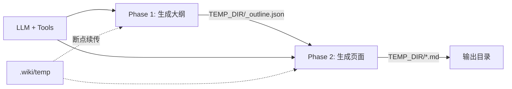
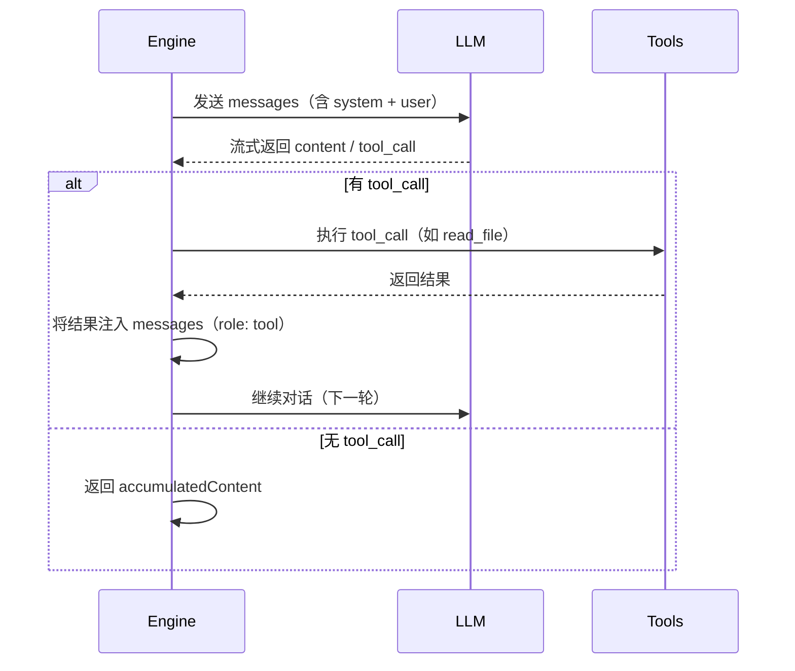

# 两阶段生成引擎

Wiki 生成并非一次 LLM 调用完成，而是拆解为两个截然不同的阶段：**先理解仓库、生成目录；再逐个页面撰写**。两阶段之间由 `TEMP_DIR` 连接，形成可断点恢复的管线。



[来源](src/commands/generate.ts#L1-L1067)

---

## Phase 1：大纲生成

`generateOutline` 是整个管线的起点。它向 LLM 发送两条 [Prompt 模板系统](prompt-模板系统.md)：`outline-system.md`（角色设定 + 分析框架）和 `outline-user.md`（工作目录 + 受众语言），然后进入 **Tool-augmented 对话循环**。

```typescript
const messages: ChatMessage[] = [
  { role: 'system', content: systemPrompt },
  { role: 'user', content: userPrompt },
];

for (let i = 0; i < maxIterations; i++) {
  const fullContent = await collectFullResponse(client, messages, config, true, useJsonMode);
  const topics = parseOutlineJson(fullContent);
  if (topics.length > 0) {
    await writeTextFile(join(TEMP_DIR, '_outline.json'), fullContent);
    return topics;
  }
  messages.push({ role: 'assistant', content: fullContent });
}
```

[来源](src/commands/generate.ts#L139-L183)

核心逻辑：每次调用 `collectFullResponse` 后，用 `parseOutlineJson` 尝试从 LLM 回复中提取 JSON。若提取成功则写入 `TEMP_DIR/_outline.json` 并返回；若失败则将 LLM 回复追加到消息列表、继续下一轮。最多 25 轮。

在 `--update` 模式下，Phase 1 会被 `updateAnalysis` 替代。LLM 收到 Git diff 和页面依赖信息后，输出一个 `UpdatePlan`（JSON），指示哪些页面需更新、新增或删除。详见 [增量更新：--update 模式](增量更新-update-模式.md)。

[来源](src/commands/generate.ts#L258-L372)

---

## `parseOutlineJson`：从非结构化输出中提取 JSON

LLM 的输出并不总是纯净 JSON——可能包裹在代码块中，或夹杂解释性文字。`parseOutlineJson` 处理这种不确定性：

```typescript
function parseOutlineJson(text: string): Topic[] {
  let cleaned = stripCodeFence(text);          // 1. 去掉 ```json ``` 包裹
  const jsonMatch = cleaned.match(/\{[\s\S]*\}/); // 2. 正则提取第一个 JSON 对象
  if (!jsonMatch) return [];

  const parsed = JSON.parse(jsonMatch[0]);      // 3. 解析
  if (!parsed.sections || !Array.isArray(parsed.sections)) return [];

  const topics: Topic[] = [];
  for (const section of parsed.sections) {
    for (const item of section.topics) {
      if (item.type === 'group') {
        topics.push({ title: item.title, isGroup: true, section: sectionName });
      } else {
        topics.push({
          title: item.title,
          level: item.level || '中级',
          slug: toSlug(item.title),
          section: sectionName,
          description: item.description || item.brief || '',
          task: item.task || item.brief || '',
        });
      }
    }
  }
  return topics;
}
```

[来源](src/commands/generate.ts#L406-L451)

三步管道：

| 步骤 | 方法 | 目的 |
|------|------|------|
| 去包裹 | `stripCodeFence()` | 移除 ` ```json ` / ` ``` ` 围栏 |
| 提取 JSON | 正则 `/\{[\s\S]*\}/` | 从任意混杂文本中取第一个 JSON 对象 |
| 结构遍历 | `parsed.sections` → `section.topics` | 扁平化成 `Topic[]` |

**向后兼容**：既支持 `description` + `task` 新字段，也支持旧版 `brief` 字段。测试覆盖了代码块包裹、额外文本环绕、无效输入等场景。

[来源](tests/outline-parser.test.ts#L1-L108)

---

## `collectFullResponse`：Tool-augmented 推理循环

这是整个生成引擎的 **核心编排器**。它不仅是简单的 LLM 调用，而是一个允许 LLM 反复调用工具的循环，最多 **30 轮**。



[来源](src/commands/generate.ts#L453-L564)

### 流式 vs 非流式

函数同时支持两种模式，由 `stream` 参数控制：

**流式模式**（Phase 1 + 串行 Phase 2）：
```typescript
const streamIter = client.chatStream(messages, genTools, jsonMode);
for await (const chunk of streamIter) {
  if (chunk.type === 'content') {
    currentContent += chunk.content;
    process.stdout.write(chunk.content);       // 实时输出到终端
  } else if (chunk.type === 'tool_call' && chunk.tool_call) {
    // 增量聚合 tool_call（处理流式分段到达的 arguments）
    // ...
  }
}
```

流式下，LLM 的 `tool_call` 可能分段到达（`arguments` 以 chunk 形式增量推送），因此用 `toolCallsMap` 按 `index` 做增量合并。详见 [LLM 客户端：流式与非流式](llm-客户端-流式与非流式.md)。

[来源](src/ai/llm-client.ts#L96-L133)

**非流式模式**（并行 Phase 2）：
```typescript
const response = await client.chat(messages, genTools, jsonMode);
currentContent = response.content || '';
// tool_calls 可直接获取
```

[来源](src/commands/generate.ts#L522-L528)

### Tool 执行与结果注入

检测到 `tool_calls` 后，循环执行：

1. 将 LLM 的 `tool_call` 以 `role: 'assistant'` 加入消息列表
2. 遍历 `toolCalls`，对每个工具调用 `executeToolCall(name, args)`
3. 将执行结果以 `role: 'tool'` 加入消息列表
4. 进入下一轮循环，LLM 看到工具返回的结果后可继续推理或再调工具

```typescript
for (const tc of toolCalls) {
  // 追踪页面依赖（用于 --update 模式）
  if (_currentPageSlug && tc.function.name === 'read_file' && args.file_path) {
    _pageDeps[_currentPageSlug].push({
      file: args.file_path,
      lines: [args.start_line || 1, args.end_line || 999999],
    });
  }
  const result = await executeToolCall(tc.function.name, args);
  messages.push({
    role: 'tool',
    tool_call_id: tc.id,
    name: tc.function.name,
    content: JSON.stringify(result),
  });
}
```

[来源](src/commands/generate.ts#L539-L558)

### 工具过滤

生成页面时，LLM 不需要访问 Wiki 本身（尚未生成完），因此 `list_wiki_pages`、`read_wiki`、`search_wiki`、`semantic_search` 等 Wiki 相关工具会被过滤掉：

```typescript
const genTools = tools || getFilteredTools().filter(t =>
  !['list_wiki_pages', 'read_wiki', 'search_wiki', 'semantic_search'].includes(t.function.name)
);
```

可用工具集合参见 [工具调用](工具调用.md)。

[来源](src/commands/generate.ts#L479-L482)

---

## Phase 2：页面生成

`generatePages` 接收 Phase 1 输出的 `Topic[]`，为每个主题调用 `collectFullResponse` 生成 `.md` 文件。每条消息携带该页面的专属 Prompt（`page-system.md` + `page-user.md`），包含页面标题、受众等级、写作任务、以及供交叉引用的 `availablePages` 列表。

[来源](src/commands/generate.ts#L569-L658)

### `runConcurrent`：Set + Promise.race 并发控制

当用户选择并行模式时，`generatePages` 调用 `runConcurrent` 来限制并发数。其实现采用 **Set + Promise.race** 模式：

```typescript
async function runConcurrent(tasks: (() => Promise<void>)[], concurrency: number): Promise<void> {
  const running = new Set<Promise<void>>();
  const queue = [...tasks];

  while (queue.length > 0 || running.size > 0) {
    // 填充到 concurrency 上限
    while (running.size < concurrency && queue.length > 0) {
      const task = queue.shift()!;
      const p = task().finally(() => running.delete(p));  // 完成即移除
      running.add(p);
    }
    // 等待任一完成
    if (running.size > 0) {
      await Promise.race(running);
    }
  }
}
```

[来源](src/commands/generate.ts#L665-L680)

设计要点：

| 特性 | 实现 |
|------|------|
| **并发上限** | `running.size < concurrency` 控制 |
| **动态填充** | 每完成一个，`Queue -> running` 补一个 |
| **无外部依赖** | 纯 `Set` + `Promise.race`，无需 `p-limit` 等库 |
| **错误隔离** | 每个 task 内部 try/catch，失败仅记入 `failed[]` |

### 串行与并行差异

| 维度 | 串行 | 并行 |
|------|------|------|
| 流式输出 | ✅ 实时显示内容 | ❌ 仅显示完成摘要 |
| 速度 | 慢 | 快（并发数控制） |
| LLM 调用模式 | `chatStream`（流式） | `chat`（非流式） |
| 适用场景 | 调试/观察生成过程 | 批量生产 |

用户通过交互式问答选择模式，也可通过 `--parallel` / `--concurrency` 参数直接指定。参见 [生成 Wiki](生成-wiki.md)。

[来源](src/commands/generate.ts#L166-L198)

---

## TEMP_DIR：checkpoint 与断点恢复

`TEMP_DIR = '.wiki/temp'` 是两阶段之间的 **共享工作目录**，也是断点恢复的关键：

- **Phase 1 输出**：`_outline.json` 写入 `TEMP_DIR`
- **Phase 2 输出**：每个页面的 `.md` 文件写入 `TEMP_DIR`，例如 `两阶段生成引擎.md`
- **已完成页面跳过**：`generatePages` 检测到文件已存在则跳过（非重试模式时）

```typescript
const pagePath = join(TEMP_DIR, `${slug}.md`);
if (!options.retryList && existsSync(pagePath)) {
  if (!options.parallel) {
    logInfo(`[${index}/${total}] Skipping already generated: ${topic.title}`);
  }
  return;
}
```

[来源](src/commands/generate.ts#L601-L606)

启动时，若 `TEMP_DIR` 存在，工具会询问用户：

```text
Previous generation temp data found. What do you want to do?
  🔄 Resume from last checkpoint
  🗑️  Discard and start fresh
```

选择 "Resume" 则保留 `TEMP_DIR` 内容，已完成的页面自动跳过。选择 "Fresh" 则删除整个目录重新开始。

[来源](src/commands/generate.ts#L76-L90)

生成完成后，`moveDir(TEMP_DIR, finalDir)` 将整个 `temp` 目录移动到最终输出路径（如 `.wiki/20250101_120000`），同时写入 `.page-deps.json`（文件依赖追踪）和 `.page-content.json`（页面内容缓存）供后续增量更新使用。

[来源](src/commands/generate.ts#L210-L215)

---

## 重试机制

生成页面失败后，系统支持多轮重试：

1. **自动重试**：通过 `--retry N` 参数指定自动重试次数
2. **交互式重试**：在非静默模式下，用户可手动选择是否重试失败页面
3. **失败隔离**：仅重试 `failed[]` 列表中的页面，不影响已成功的

```typescript
let retriesLeft = opts.retry ?? 0;
while (failed.length > 0 && retriesLeft > 0) {
  logWarning(`${failed.length} page(s) failed. Retrying (${retriesLeft} left)...`);
  const retryResult = await generatePages(client, config, workDir, topics,
    { ...pageGenOptions, retryList: [...failed] });
  failed = retryResult;
  retriesLeft--;
}
```

[来源](src/commands/generate.ts#L184-L195)

---

## 推荐阅读

- [Prompt 模板系统](prompt-模板系统.md) — 了解 Phase 1/Phase 2 所用的 `outline-*.md` 和 `page-*.md` 模板结构
- [LLM 客户端：流式与非流式](llm-客户端-流式与非流式.md) — `chatStream` 和 `chat` 的底层实现细节
- [Tool 系统：定义与执行](tool-系统-定义与执行.md) — 13 个工具的 Schema 定义和执行链
- [增量更新：--update 模式](增量更新-update-模式.md) — 基于 Git diff 的精确增量更新
- [生成 Wiki](生成-wiki.md) — `generate` 命令的完整参数列表和用法