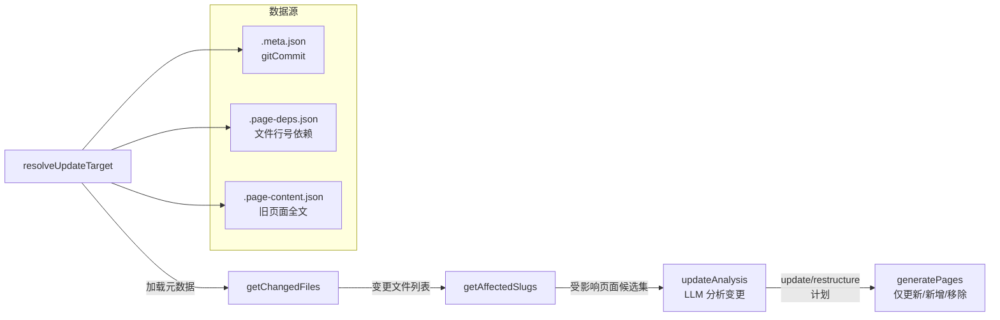

现在我已阅读所有核心代码，准备撰写。

# 增量更新：`--update` 模式

**增量更新**是 wiki-cli 区别于一次性文档生成的标志性能力。它利用 Git 差异分析和页面级依赖追踪，实现精准的"只重写受影响页面"——而非每次全量生成。

## 架构总览

增量更新的执行分三个阶段：



整个流程从 `resolveAndRunUpdate`（`src/commands/generate.ts#L907-L914`）入口启动，该函数在 `--update` 标志置位时被调用。[来源](src/commands/generate.ts#L907-L994)

## 第一步：解析更新目标

`resolveUpdateTarget`（`src/commands/generate.ts#L788-L818`）负责加载上一次 Wiki 生成的快照数据：

1. 定位 `.wiki/` 目录下的最新版本子目录（按名称排序取最后一个）
2. 读取 `.meta.json`，提取 `gitCommit` 字段——记录此前 Wiki 生成时的 HEAD 提交
3. 验证该提交仍在 Git 历史中（`git cat-file -t`），防止 rebase/gc 导致引用失效
4. 读取 `.page-deps.json` → 反序列化为 `PageDeps` 对象
5. 读取 `.page-content.json` → 缓存旧页面全文供 LLM 对比

若 `.page-deps.json` 不存在，日志发出警告"没有页面依赖记录，增量更新将保守处理"——此时后续的 `getAffectedSlugs` 会标记所有页面为候选，依赖追踪降级为全量标记模式。[来源](src/commands/generate.ts#L788-L832)

## 第二步：Git 差异分析

### getChangedFiles：获取变更清单

```typescript
export function getChangedFiles(oldCommit: string, cwd: string): ChangedFile[]
```

运行 `git diff ${oldCommit}..HEAD --name-status --diff-filter=ADMR`，解析返回的逐行变更状态。每个文件被标记为 `modified`、`added`、`deleted` 或 `renamed`。[来源](src/utils/diff.ts#L31-L39)

该函数使用 `--diff-filter=ADMR` 排除未追踪文件（仅追踪已纳入 Git 版本控制的变更），确保只关注可追溯的修改。

### getAffectedSlugs：行级别精准命中

这是核心算法所在。`getAffectedSlugs`（`src/utils/diff.ts#L80-L106`）接收四参数：页面依赖表、变更文件列表、工作目录、旧提交哈希。

对每个变更文件：

- **deleted / renamed**：采用保守策略，遍历所有页面依赖，若该页面曾读取此文件则标记为受影响。`continue` 跳过差异行分析。
- **modified**：调用 `getChangedRanges`（`src/utils/diff.ts#L43-L51`）提取 Git Hunk 头中的行号范围。Hunk 头格式为 `@@ -oldStart,oldCount +newStart,newCount @@`，解析出 `[start, end]` 数值对。

```typescript
// 从 diff hunk 头解析变更行号范围
function parseHunks(diff: string): [number, number][] {
  const hunkHeaderRe = /^@@ -\d+(?:,\d+)? \+(\d+)(?:,(\d+))? @@/;
  // 提取每个 hunk 的 [startLine, endLine]
}
```

获得变更行范围后，与 `pageDeps[slug][filePath]` 中记录的页面读取范围进行 **rangesOverlap** 检查：

```typescript
export function rangesOverlap(
  pageRanges: [number, number][],
  changedRanges: [number, number][]
): boolean {
  for (const [ps, pe] of pageRanges) {
    for (const [cs, ce] of changedRanges) {
      if (ps <= ce && pe >= cs) return true;
    }
  }
  return false;
}
```

这是经典的区间重叠判定：两个区间 `[ps, pe]` 和 `[cs, ce]` 重叠当且仅当 `ps <= ce && pe >= cs`。[来源](src/utils/diff.ts#L68-L78)

若任何页面读取区间与任何变更区间重叠，该页面被标记为"受影响"。注意这是**线性扫描**——因为页面依赖量和变更文件量通常较小（几十到几百级别），O(n*m) 复杂度可接受。

## 第三步：LLM 变更分析

`updateAnalysis`（`src/commands/generate.ts#L353-L444`）将技术层面的行号重叠匹配升维到语义层面的变更判断。

### 输入构建

函数组装两条 Prompt：

**System Prompt**（`prompts/update-system.md`）：定义 LLM 的角色为 Wiki 维护者，提供可用工具（`read_file`、`search_in_files`、`git_show`、`read_wiki` 等），明确判断规则：
- 纯注释修改、变量重命名、代码格式化等**不改变语义**的变更 → 不需要更新
- 页面依赖文件变更但语义未变 → 标记为 `update` 由生成阶段判断
- 新增文件可文档化 → 建议 `add`
- 已删除功能 → 建议 `remove`
- 架构根本性变化 → 输出 `restructure` 触发全量回退

**User Prompt**（`prompts/update-user.md`）：注入以下数据：
- 原始目录结构（`index.json` 序列化）
- 变更文件摘要（每条变更附带"影响页面"列表，基于 `pageDeps` 反向关联）
- 候选页面详细信息（每个候选页面的 slug、依赖文件及读取行号范围）
- 候选页面旧版本全文（`pageContentCache` 注入）
- 新增文件列表

```typescript
const changedSummary = changedFiles.map(f => {
  const deps = Object.entries(pageDeps)
    .filter(([, deps]) => deps[f])
    .map(([slug]) => slug);
  return `- ${f} 影响页面: ${deps.join(', ') || '(无)'}`;
}).join('\n');
```

### 迭代与解析

LLM 响应通过最多 8 轮迭代（含工具调用辅助验证）收敛为 JSON 格式的 `UpdatePlan`：

```typescript
interface UpdatePlan {
  action: 'update' | 'restructure';
  update?: string[];   // 需更新的 slug 列表
  add?: Topic[];       // 新增页面数组
  remove?: string[];   // 需移除的 slug 列表
  _reason?: string;    // 中文解释
}
```

若 LLM 判定 `action: 'restructure'`，`resolveAndRunUpdate` 返回 `null`，外层回退到全量生成流程。[来源](src/commands/generate.ts#L968-L972)

若 `action: 'update'`，进入页面级精确调度阶段。

## 第四步：精确调度

### 三集合模型

`resolveAndRunUpdate` 将计划拆解为三个集合：

```typescript
const removeSet = new Set(updatePlan.remove || []);
const addTopics = updatePlan.add || [];
const updateSet = new Set(updatePlan.update || []);
```

**复制逻辑**：遍历旧版 `topics`，对既不在 `removeSet` 也不在 `finalUpdateSet` 的 topic，将完整的 `.md` 文件从旧版本目录复制到临时目录。这确保了**无需修改的页面直接复用**，零 LLM 调用。

### 回退策略

当 `.page-deps.json` 为空（如首次增量更新前的全量生成未启用依赖追踪），但 `affectedSlugs` 非空时，`finalUpdateSet` 退化为 `new Set(affectedSlugs)`——即**所有代码行有重叠的页面全部更新**，放弃 LLM 的语义过滤。[来源](src/commands/generate.ts#L978-L982)

## 第五步：页面级依赖追踪（_pageDeps）

依赖追踪是整个增量更新的基石。它通过**拦截 tool call** 实现自动记录。

### 记录时机

在 `collectFullResponse`（页面生成的核心函数）中，当 LLM 调用 `read_file` 工具时：

```typescript
// src/commands/generate.ts#L655-L656
if (_currentPageSlug && tc.function.name === 'read_file' && args.file_path) {
  const startLine = args.start_line || 1;
  const endLine = args.end_line || 999999;
  if (!_pageDeps[_currentPageSlug]) _pageDeps[_currentPageSlug] = [];
  _pageDeps[_currentPageSlug].push({ file: args.file_path, lines: [startLine, endLine] });
}
```

每个页面生成期间，LLM 每次读取文件都记录 `(filePath, [startLine, endLine])` 到全局字典。`_currentPageSlug` 在当前页面生成期间置位，生成完成后设回 `null`。[来源](src/commands/generate.ts#L24-L26)

### 持久化

生成完成后，`savePageMetadata`（`src/commands/generate.ts#L997-L1016`）执行**区间合并**：

```typescript
for (const [slug, entries] of Object.entries(_pageDeps)) {
  // 合并重叠的区间
  let merged = false;
  for (const range of fileMap[entry.file]) {
    if (entry.lines[0] <= range[1] && entry.lines[1] >= range[0]) {
      range[0] = Math.min(range[0], entry.lines[0]);
      range[1] = Math.max(range[1], entry.lines[1]);
      merged = true;
      break;
    }
  }
  if (!merged) fileMap[entry.file].push([...entry.lines]);
}
```

合并逻辑同样使用区间重叠判定：若新记录的行范围与已有记录重叠，则扩展已有范围而非新增条目。这保证了依赖数据紧凑可读。[来源](src/commands/generate.ts#L997-L1016)

最终输出两个文件：
- `.page-deps.json`：页面 → 文件 → 行号范围的嵌套结构
- `.page-content.json`：页面 slug → 全文的映射（用于下次增量更新时的 LLM 输入）

## 数据流全景

```
全量生成时                               增量更新时
─────────                               ─────────
生成页面                                 读取 .meta.json
  │                                        │
  ├─ LLM 读文件时记录 _pageDeps             ├─ getChangedFiles
  │                                        │
  ├─ savePageMetadata 输出                  ├─ getAffectedSlugs
  │   .page-deps.json                      │   ├─ rangesOverlap
  │   .page-content.json                   │   └─ 生成候选集
  │                                        │
  └─ .meta.json (含 gitCommit)             ├─ updateAnalysis (LLM)
                                           │   ├─ 注入旧页面全文
                                           │   ├─ 注入变更摘要
                                           │   └─ 输出 UpdatePlan
                                           │
                                           ├─ 复制未修改页面
                                           ├─ 生成 update/add 页面
                                           └─ 跳过 remove 页面
```

## 边界情况与容错

| 场景 | 处理方式 |
|---|---|
| `.page-deps.json` 不存在 | 降级为保守模式：所有受影响文件关联的页面均标记 |
| `oldCommit` 在 Git 历史中已丢失（rebase/gc） | 检测到 `git cat-file -t` 失败，回退全量 |
| 变更文件数为 0 | 日志警告后 `process.exit(0)`，不执行任何操作 |
| LLM 连续 8 轮未返回有效 JSON | 默认返回 `restructure` 触发全量回退 |
| 新增文件（added） | 不参与 `getAffectedSlugs` 的行级匹配，而是在 `updateAnalysis` 中专门传递给 LLM 判断是否需新增页面 |
| 并行生成与增量更新 | 并行模式仍适用，但依赖追踪仅对实际生成的页面有效；已复制的页面不涉及依赖更新 |

## 依赖追踪的局限

当前的 `_pageDeps` 机制存在两个已知局限：

1. **仅追踪 `read_file`**：LLM 若通过 `search_in_files`、`git_show` 等工具获取信息，这些依赖不会被记录。若某页面仅通过搜索而非直接读取文件获取信息，行级重叠判定将漏检。
2. **行号基于生成时的快照**：若 LLM 不指定 `start_line`/`end_line`，默认回退为 `[1, 999999]`（即整文件），导致后续任何行变更都会触发重叠。这在实践中常见——许多 LLM 调用 `read_file` 时不带行号参数。[来源](src/commands/generate.ts#L653-L654)

## 推荐阅读

- [两阶段生成引擎](两阶段生成引擎.md)——理解 `_pageDeps` 是在哪个生成循环中被记录的
- [Git 差异分析与依赖追踪](git-差异分析与依赖追踪.md)——`getAffectedSlugs` 和 `rangesOverlap` 的独立专题分析
- [生成 Wiki](生成-wiki.md)——`--update` 标志的命令行入口与选项详解
- [Prompt 模板系统](prompt-模板系统.md)——`update-system.md` 和 `update-user.md` 的完整定义
- [查看状态](查看状态.md)——`status` 命令提供增量更新的前置预览能力