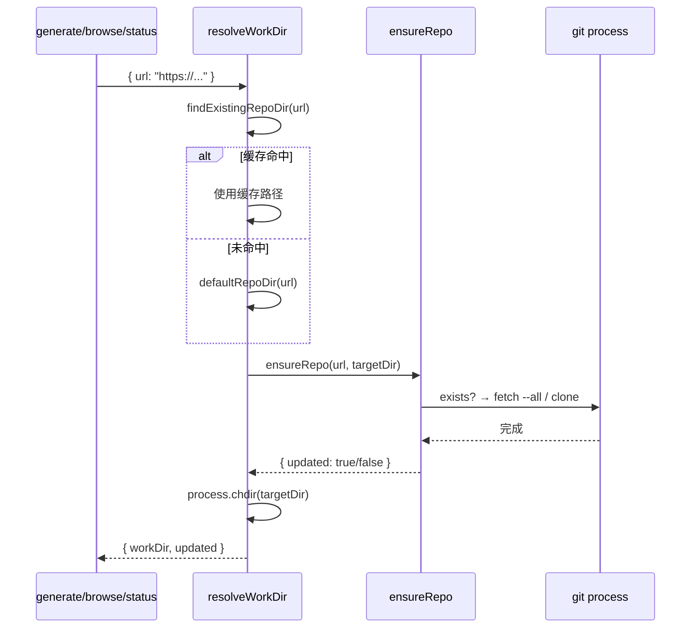

# 工作目录解析

`resolveWorkDir` 是 wiki-cli 所有命令（generate、browse、status、ai）共享的入口函数。它的职责是：**将用户传递的目录参数（本地路径、远程 URL、临时标志）统一转化为一个可执行的本地工作目录**，并在此过程中完成仓库的克隆、更新、分支切换等操作。

---

## 核心接口：`WorkDirResult`

每次解析返回一个标准结果：

```typescript
interface WorkDirResult {
  workDir: string;          // 解析后的工作目录（绝对路径）
  outputDir?: string;       // 仅本地目录场景有效，指定 Wiki 输出位置
  updated?: boolean;        // 仓库是否发生了更新
  cleanup?: () => Promise<void>;  // temp 模式专用：删除临时目录
}
```

[来源](src/utils/workspace.ts#L10-L16)

`workDir` 是后续所有操作的根目录——生成引擎读取代码、diff 工具对比版本、AI 问答模块搜索代码，都基于这个目录。

---

## 四种场景的解析逻辑

`resolveWorkDir` 根据 `options` 参数组合，按优先级依次匹配四种场景。

### 场景一：仅 `-C dir` → 切换到本地目录

最常见的用法。用户指定一个本地已有仓库，函数直接将其解析为工作目录。如果传了 `--branch` 参数，还会在本地执行 `git checkout` 切换分支。

```typescript
if (branch) {
  execSync(`git checkout ${branch}`, { cwd: workDir, stdio: 'pipe' });
}
```

配合 `-o output` 可以指定 Wiki 输出位置。无需联网，适用于已有完整代码库的场景。

[来源](src/utils/workspace.ts#L91-L109)

### 场景二：`-u url`（无 `-o`，无 `-t`）→ 缓存到 `~/.wiki-cli/repos/`

当用户只提供远程 URL 而没有指定输出路径和临时标志时，函数会按优先级查找或创建缓存目录：

1. **查找已有缓存**——调用 `findExistingRepoDir(url)` 在所有 `repoDirs` 中搜索同名的已克隆仓库
2. **首次克隆**——如果未找到缓存，使用 `defaultRepoDir(url)` 在默认目录下创建

`defaultRepoDir` 取 `getRepoDirs()[0]`（即第一个配置的 repo 目录），末尾追加 URL 转换后的目录名。生成 Wiki 时 `outputDir` 为 `undefined`，引擎会默认输出到仓库内的 `.wiki/` 目录。

[来源](src/utils/workspace.ts#L68-L76)

### 场景三：`-u url -o output` → 克隆到指定路径

用户显式指定了输出路径。函数会先确保目标目录存在（递归创建），然后在此目录上执行 `ensureRepo`。仓库和 Wiki 输出目录合二为一，适合用户希望完整掌控文件布局的场景。

```typescript
targetDir = resolve(output);
await mkdir(targetDir, { recursive: true });
```

[来源](src/utils/workspace.ts#L65-L67)

### 场景四：`-u url -t` → 克隆到临时目录，用后清理

`--temp` 标志适用于一次性生成。函数调用 `mkdtempSync` 在系统临时目录创建 `wiki-cli-*` 前缀的目录，克隆完成后设置一个 `cleanup` 回调——调用方（如 `generateCommand` 或 `aiCommand`）在生成结束后执行 `rm -rf` 清理现场。

```typescript
if (temp) {
  return {
    workDir: targetDir,
    cleanup: async () => {
      const { rm } = await import('node:fs/promises');
      await rm(targetDir, { recursive: true, force: true });
    },
  };
}
```

这种方式不会留下任何磁盘痕迹，适合 CI 环境或一次性的实验性生成。

[来源](src/utils/workspace.ts#L78-L88)

---

## 缓存查找系统：`findExistingRepoDir`

`findExistingRepoDir` 是跨命令共享的核心工具，`browse` 和 `status` 命令也直接用到它。

它的查找逻辑分三步：

1. 将 URL 转为目录名（`urlToDirName`）
2. 遍历所有 `repoDirs`
3. 在各目录下拼接完整路径，检查磁盘是否存在

**URL 转目录名**的规则非常关键：去掉 `https://` 前缀、去掉 `.git` 后缀、将 `/:` 替换为 `-`。例如：

| URL | 目录名 |
|-----|--------|
| `https://github.com/user/repo.git` | `github.com-user-repo` |
| `https://gitlab.com/org/project` | `gitlab.com-org-project` |

```typescript
function urlToDirName(url: string): string {
  const cleaned = url
    .replace(/^https?:\/\//, '')
    .replace(/\.git$/, '')
    .replace(/[\/:]/g, '-');
  return cleaned;
}
```

[来源](src/utils/workspace.ts#L34-L40)

**`repoDirs` 的来源**是 `getRepoDirs()` 函数：优先读取 `~/.wiki-cli/config.json` 中的 `repoDirs` 数组，如果未配置则回退到 `[~/.wiki-cli/repos]`。这意味着用户可以通过 [配置文件详解](配置文件详解.md) 中的 `repoDirs` 字段自定义缓存位置。

[来源](src/utils/workspace.ts#L22-L31)

---

## Git 操作的后端：`ensureRepo`

`resolveWorkDir` 在确定目标目录后，会委托 `ensureRepo` 执行实际的 Git 操作。`ensureRepo` 的分支逻辑非常清晰：

### 目录已存在 → `git fetch --all` + 合并

如果目标目录已在磁盘上，说明这是一个**已缓存的仓库**。函数先尝试 `git fetch --all` 拉取远程最新提交。如果网络不可用（例如 CI 环境无外网），捕获异常后降级返回 `{ updated: false }`，调用方可以据此决定是否复用已有 Wiki。

拉取成功后，根据是否指定 `branch` 决定合并策略：

- **有分支** → `git checkout <branch>` + `git merge origin/<branch>`
- **无分支** → `git merge`（合并当前跟踪分支）

### 目录不存在 → `git clone`

如果目标目录不存在，执行完整克隆。`depth` 和 `branch` 参数会透传给 `git clone --depth <n> --branch <branch>`。

```typescript
const cmd = `git clone ${depthFlag} ${branchFlag} ${url} "${targetDir}"`;
```

错误时直接抛出，由上层调用方（如 `generateCommand`）处理并终止流程。

[来源](src/utils/git.ts#L10-L47)

---

## 调用链路全景

以下时序图展示 `-u url` 无 `-o` 无 `-t` 的典型流程：



---

## 各命令的使用差异

虽然四个命令都依赖 `resolveWorkDir` 或其辅助函数，但使用方式略有不同：

| 命令 | 使用的函数 | 特殊处理 |
|------|-----------|---------|
| [生成 Wiki](生成-wiki.md) | `resolveWorkDir` | 检查 `updated=false` 时询问是否重新生成 |
| [浏览 Wiki](浏览-wiki.md) | `findExistingRepoDir` + `defaultRepoDir` | 仅定位仓库，无需更新 |
| [查看状态](查看状态.md) | `findExistingRepoDir` + `defaultRepoDir` | 仅定位仓库，对比版本差异 |
| [AI 问答](ai-问答.md) | `resolveWorkDir` | 使用 `temp` 模式时自动清理 |

[来源](src/commands/generate.ts#L53-L75)、[来源](src/commands/browse.ts#L51)、[来源](src/commands/status.ts#L23)、[来源](src/commands/ai.ts#L35)

---

## 下一步

- 了解生成引擎如何使用解析后的 `workDir` → [两阶段生成引擎](两阶段生成引擎.md)
- 学习 `-u url -b branch` 如何与增量更新协作 → [Git 差异分析与依赖追踪](git-差异分析与依赖追踪.md)
- 查看 `repoDirs` 配置项详情 → [配置文件详解](配置文件详解.md)