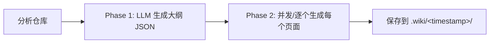

```markdown
# 概览

**wiki-cli** 是一个命令行工具：输入任意 Git 仓库（本地或远程），输出一份结构化 Wiki 文档，全程由 LLM 驱动，无需手动编写一行。

项目地址：[Epheia/wiki-cli](https://github.com/Epheia/wiki-cli)

---

## 六条命令，一个工具

所有功能集中在六条命令上，各自解决一个独立问题：

| 命令 | 一句话用途 | 适用场景 |
|------|-----------|----------|
| `config` | 交互式配置 LLM Provider、Model、API Key 和语言 | 首次使用 or 更换模型 |
| `generate` | 分析仓库代码，生成完整 Wiki 文档 | 核心功能——把代码变成文档 |
| `browse` | 启动内置 HTTP 服务器，在浏览器中阅读 Wiki | 浏览生成的文档，查看源码和版本切换 |
| `ai` | 与代码库对话：交互式聊天或单次问答 | 想了解代码设计细节，不需要从头生成文档 |
| `tool-call` | 为外部 AI Agent 暴露只读工具接口，输出 JSON | CI/CD 工具链或 AI Agent 需要读取仓库信息 |
| `status` | 对比当前 Git 状态与 Wiki 版本的差异 | 代码更新后，检查 Wiki 是否需要重新生成 |

每个命令的详细用法都在独立页面中：

- [配置文件详解](配置文件详解.md) 说明 `config` 的全部配置项
- [生成 Wiki](生成-wiki.md) 涵盖 `generate` 的本地/远程/并行/断点续传等模式
- [浏览 Wiki](浏览-wiki.md) 介绍 `browse` 的导航、源码查看和版本切换
- [AI 问答](ai-问答.md) 详解 `ai` 的交互式聊天、斜杠命令和会话管理
- [工具调用](工具调用.md) 列出 `tool-call` 的 13 个只读工具及调用方式
- [查看状态](查看状态.md) 展示 `status` 的输出格式和比较逻辑

[来源](src/cli.ts#L8-L112)

---

## 两阶段生成：大纲先行，页面后写

生成 Wiki 不是一次把全部内容丢给 LLM。它拆成两个阶段：



**Phase 1** — LLM 分析仓库的文件结构、依赖关系和关键模块，输出一份结构化的 **JSON 大纲**。大纲中定义了有哪些页面、每个页面的 slug、难度级别和写作任务。

**Phase 2** — 引擎拿这份大纲，为每个 Topic 调用 LLM 生成 Markdown 页面。页面之间可以交叉引用，因为大纲结构已知。支持 **并发生成**（`--parallel -c 5`）来提速 3–5 倍。

如果在生成中途用 Ctrl+C 中断，再次运行时会检测到临时数据，询问是否 **断点续传**（resume），不浪费已生成的 token。

[来源](src/commands/generate.ts#L40-L115)

两阶段的核心逻辑在 [两阶段生成引擎](两阶段生成引擎.md) 中有完整描述。

在此基础上还支持 **增量更新模式**（`--update`）：只重新生成受 Git diff 影响的页面，详见 [增量更新 --update 模式](增量更新-update-模式.md)。

---

## LLM 无关性：换模型不改代码

wiki-cli 不绑定任何一家 LLM 提供商。所有 LLM 交互走 **OpenAI 兼容 API** 协议，只要 Provider 提供 `/v1/chat/completions` 端点就能接入。

当前支持的 7 家 LLM 提供商：

| Provider | 推荐模型 | JSON 模式 |
|----------|---------|-----------|
| OpenAI | gpt-5.5, gpt-5.4-mini | ✅ |
| DeepSeek | deepseek-v4-flash, deepseek-v4-pro | ✅ |
| Anthropic (Claude) | claude-sonnet-4-6, claude-haiku-4-5 | ❌ |
| Google Gemini | gemini-3.1-pro, gemini-3-flash | ❌ |
| xAI Grok | grok-4.3, grok-4-1-fast-reasoning | ✅ |
| Kimi (Moonshot) | kimi-k2.6 | ✅ |
| Mistral | mistral-large-3, devstral-2 | ✅ |

支持 **JSON 模式** 的 Provider 在 Phase 1 生成大纲时能输出更稳定的结构化结果。不支持 JSON 模式的模型（Claude、Gemini）则通过 Prompt 约束来保证输出格式。

自定义 Provider 只需通过 `wiki-cli config` 或直接编辑配置文件，填入 base URL 和模型名即可——详见 [自定义 LLM 与 Embedding](自定义-llm-与-embedding.md)。

[来源](src/config/default-models.json) · [来源](src/config/config-store.ts#L44-L52)

---

## 特色能力速览

从 README 中整理的核心能力：

| 能力 | 说明 |
|------|------|
| **流式输出** | LLM 生成的每个字实时可见，还显示推理过程（如 Grok 的 reasoning tokens） |
| **Tool Call** | LLM 在生成页面时可调用工具读源码、列目录、搜 Wiki，答案附带真实代码证据 |
| **语义搜索** | 可选配置 Embedding 模型，AI 问答时能通过余弦相似度检索相关 Wiki 页面 |
| **会话管理** | AI 对话支持 `/save`、`/undo`、`/switch` 等斜杠命令，退出时显示续行命令 |
| **远程仓库** | `--url` 参数直接克隆远程 Git 仓库并生成 Wiki |
| **本地浏览** | 内置 HTTP 服务器，支持代码语法高亮、Mermaid 图表渲染、历史版本切换 |
| **跨平台** | Windows / macOS / Linux 通杀，Node.js >= 18 |

流式输出的底层实现在 [LLM 客户端：流式与非流式](llm-客户端-流式与非流式.md) 中详解。Tool Call 的 13 个工具定义见 [Tool 系统：定义与执行](tool-系统-定义与执行.md)。语义搜索的具体算法和缓存策略在 [语义搜索与 Embedding](语义搜索与-embedding.md) 中说明。会话管理的 CRUD 逻辑在 [会话管理系统](会话管理系统.md) 中展开。

[来源](README.md#L12-L27)

---

## 设计原则

- **Prompt 与代码分离**：所有 Prompt 放置在 `prompts/` 目录下的独立 `.md` 文件中，不改代码就能调整文案——详见 [Prompt 模板系统](prompt-模板系统.md)。
- **只读工具**：LLM 只能读文件、列目录、搜代码，无法修改项目内容。
- **版本化缓存**：生成结果按时间戳存入 `.wiki/<timestamp>/`，可随时切换浏览历史版本。
- **会话持久化**：AI 对话历史保存在 `.wiki/sessions/`，支持跨项目查找。

项目的完整目录结构见 [命令行入口与命令注册](命令行入口与命令注册.md)。

---

## 下一步

- [快速开始](快速开始.md) — 5 分钟完成安装、配置和首次生成
- [生成 Wiki](生成-wiki.md) — 了解 `generate` 的全部选项
- [两阶段生成引擎](两阶段生成引擎.md) — 深入 Phase 1 + Phase 2 的内部流程
```