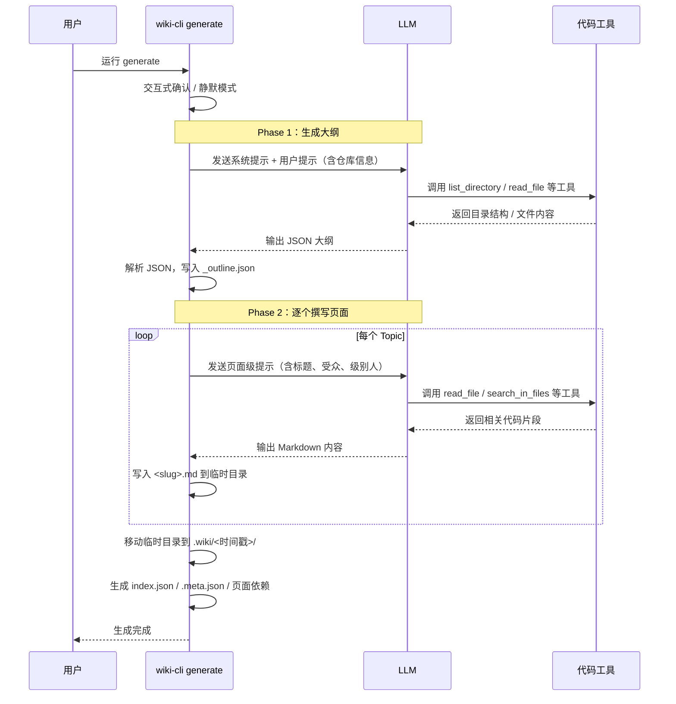
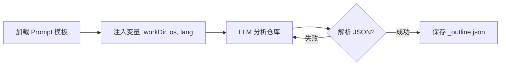
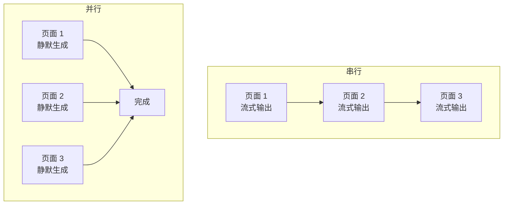

```markdown
> **一句话概括**：`wiki-cli generate` 是一个基于 LLM 的两阶段文档生成器——先让 AI 理解你的代码仓库并规划目录，再逐页撰写，最后打包成完整的结构化 Wiki。

---

## 从零到 Wiki，只需一条命令

假设你有一个开源项目，想让团队快速上手，或者你想把某个源码库变成可浏览的文档——`generate` 命令会读取仓库的源代码，**先自动分析目录结构、文件内容、Git 历史**，然后生成一份结构合理的文档大纲，最后用 LLM 为每个主题撰写完整的 Markdown 页面。

```bash
# 最常见用法：在项目根目录直接生成
npx wiki-cli generate

# 或者从远程仓库克隆并生成
npx wiki-cli generate --url https://github.com/your/repo.git
```

命令执行完成后，Wiki 被写入 `.wiki/<时间戳>/` 目录。你可以打开浏览器查看，或者直接带上 `--browse` 让它自动启动内置服务器。[浏览 Wiki](浏览-wiki.md) 页面详细介绍了查看方式。

[来源](src/cli.ts#L47-L80)

---

## 核心流程：两个阶段

`generate` 的整个生成过程分为两个阶段，每一阶段都依赖 LLM 与代码工具的配合。



[来源](src/commands/generate.ts#L65-L109)

---

## Phase 1：大纲生成（LLM 分析仓库）

这是最"神奇"的一步。`generate` 将仓库的绝对路径、操作系统信息等环境变量注入到 **Prompt 模板**中，然后发送给 LLM。



具体过程如下：

1. 加载 `prompts/outline-system.md` 和 `prompts/outline-user.md` 两个模板，注入 `workDir`（工作目录）、`os`（操作系统）和 `lang`（语言设置）变量。[来源](src/commands/generate.ts#L93-L97)
2. LLM 被允许使用代码工具（`list_directory`、`read_file`、`search_in_files`、`git_log` 等）探索仓库结构。
3. LLM 输出一个 JSON 对象，包含 `sections`（文档章节）和 `topics`（每个章节下的主题）。
4. `parseOutlineJson` 函数解析响应，提取每个主题的标题、难度等级（`level`）、描述（`description`）和写作指令（`task`）。[来源](src/commands/generate.ts#L271-L309)
5. 如果解析失败，会继续与 LLM 对话（最多 25 轮），直到获得有效的 JSON 大纲。[来源](src/commands/generate.ts#L105-L140)
6. 成功后，JSON 大纲被写入 `.wiki/temp/_outline.json`，供 Phase 2 使用。[来源](src/commands/generate.ts#L125-L126)

> **难度等级**：每个页面都会标注 `初学`、`中级` 或 `高级`，这一信息会传递给写页面的 LLM，确保内容深度适配目标读者。

[来源](src/commands/generate.ts#L91-L140)

---

## Phase 2：页面生成（并发撰写）

拿到大纲后，`generate` 进入 Phase 2——为每一个 `Topic` 生成对应的 Markdown 文件。

### 逐页生成

对每个非分组（`isGroup`）的主题：

1. 加载 `prompts/page-system.md` 和 `prompts/page-user.md` 模板，注入标题、受众等级、slug、`availablePages`（所有其他页面的交叉引用信息）等变量。[来源](src/commands/generate.ts#L368-L396)
2. LLM 再次使用代码工具读取相关源文件，撰写完整的 Markdown 内容。
3. 内容写入 `.wiki/temp/<slug>.md`。[来源](src/commands/generate.ts#L400-L408)

### 并行模式（--parallel）

默认条件下，页面是一个接一个（串行）生成的，这样你可以在终端看到流式输出的过程。启用 `--parallel` 后，多个页面会**并发生成**，大幅缩短总耗时，但代价是无法看到每个页面的实时流式输出。

并发数由 `--concurrency` 控制（默认 3，最大 10）。[来源](src/commands/generate.ts#L201-L209)



`runConcurrent` 函数用 `Promise.race` + 信号量模式控制并发：启动不超过 `concurrency` 个任务，每完成一个就从队列取出下一个。[来源](src/commands/generate.ts#L415-L427)

### 自动重试（--retry）

如果某些页面生成失败（如 LLM 超时或网络波动），`--retry <N>` 会自动重试最多 N 次。每次重试只重新生成失败的页面，不影响已成功的。[来源](src/commands/generate.ts#L110-L116)

### 交互式重试

即使在非静默模式下，所有自动重试用完后，仍然会询问你是否要继续手动重试失败的页面，给你充分的回旋余地。[来源](src/commands/generate.ts#L118-L128)

---

## 断点续传：重新运行从断点恢复

生成过程可能因为网络中断或 LLM API 错误而中途停止。`generate` 内置了**断点续传**机制：

1. **临时目录**：所有生成的页面先写入 `.wiki/temp/` 目录。[来源](src/commands/generate.ts#L19)
2. **恢复检测**：下次运行 `generate` 时，如果检测到 `TEMP_DIR` 已存在，会询问用户：[来源](src/commands/generate.ts#L60-L72)
   - **🔄 从上次检查点恢复**：跳过已生成的页面，只生成缺失的。
   - **🗑️ 丢弃并重新开始**：清空临时目录，从头生成。
3. **静默模式**：在 `--silent` 模式下自动丢弃旧的临时数据，不会等待用户交互。[来源](src/commands/generate.ts#L61-L63)

```bash
# 如果中途中断，只需再运行一次：
npx wiki-cli generate
# → 询问：是否从上次检查点恢复？
```

---

## 交互式确认流程

在没有 `--silent` 参数时，`generate` 会在多个节点与用户交互，适合新手熟悉流程：

| 步骤 | 交互内容 | 代码位置 |
|------|---------|---------|
| 仓库未更新 | 确认是否重新生成，或直接打开已有 Wiki | [L42-L57](src/commands/generate.ts#L42-L57) |
| 恢复检查点 | 选择从上次断点继续还是重新开始 | [L62-L72](src/commands/generate.ts#L62-L72) |
| 并行配置 | 询问是否并行、并发数 | [L168-L184](src/commands/generate.ts#L168-L184) |
| 失败重试 | 是否重试失败的页面 | [L118-L127](src/commands/generate.ts#L118-L127) |
| 打开浏览器 | 生成完成后是否启动浏览服务器 | [L161-L166](src/commands/generate.ts#L161-L166) |

> **小技巧**：在 CI/CD 环境中务必使用 `--silent`，避免管道因等待输入而挂起。

---

## 全部选项速查

| 选项 | 简写 | 默认值 | 说明 |
|------|------|--------|------|
| `--dir` | `-C` | 当前目录 | 本地仓库路径 |
| `--url` | `-u` | — | 远程 Git 仓库 URL（自动克隆） |
| `--output` | `-o` | `.wiki/<时间戳>` | Wiki 输出目录 |
| `--branch` | `-b` | 默认分支 | Git 分支 |
| `--depth` | `-d` | 完整克隆 | Git 浅克隆深度 |
| `--temp` | `-t` | false | 临时模式（仅远程 URL 时有效，用完清理克隆） |
| `--parallel` | `-p` | false | 并行生成页面 |
| `--concurrency` | `-c` | 3 | 并行数（仅 `--parallel` 时有效，范围 1-10） |
| `--retry` | `-r` | 0 | 失败页面自动重试次数 |
| `--silent` | `-s` | false | 静默模式：跳过所有交互式提示 |
| `--browse` | — | false | 生成完后自动启动浏览服务器 |
| `--update` | — | false | 增量更新模式（详见下文） |

[来源](src/cli.ts#L47-L80)

---

## 工作目录解析与输出

`generate` 依赖 `resolveWorkDir` 函数（来自 [工作目录解析](工作目录解析.md)）来确定源仓库和输出位置。

- **本地仓库**：默认使用当前工作目录，或 `-C <path>` 指定的目录。[来源](src/utils/workspace.ts#L95-L100)
- **远程仓库**：通过 `-u <URL>` 克隆到 `~/.wiki-cli/repos/` 缓存目录（如果已存在则直接使用缓存）。也可通过 `-o <path>` 指定克隆位置。[来源](src/utils/workspace.ts#L72-L93)
- **输出目录**：默认是 `.wiki/<YYYY-MM-DDThh-mm-ss>` 时间戳目录，可通过 `-o` 自定义。[来源](src/commands/generate.ts#L143-L145)

生成完成后，完整的 Wiki 目录结构如下：

```
.wiki/
├── 2025-01-15T10-30-00/      ← 时间戳版本目录
│   ├── index.json            ← 大纲 JSON（供浏览服务器渲染导航）
│   ├── .meta.json            ← 元数据（Git commit、branch、remote）
│   ├── .page-deps.json       ← 页面-文件依赖追踪（用于增量更新）
│   ├── .page-content.json    ← 各页面原始内容缓存（用于增量更新）
│   ├── 概览.md
│   ├── 快速开始.md
│   ├── 生成-wiki.md
│   └── ...
└── temp/                     ← 生成过程中临时存储
```

[来源](src/commands/generate.ts#L143-L158)

---

## --update 模式：增量更新

> 这个开关在本页仅做提要参考，完整原理请查阅 [增量更新：--update 模式](增量更新-update-模式.md)。

当你对已有 Wiki 的仓库做了修改后，不需要重新生成所有页面，只需带上 `--update` 参数：

1. 读取最新版本 Wiki 的 `index.json`、`.page-deps.json` 和 `.page-content.json`。[来源](src/commands/generate.ts#L434-L500)
2. 通过 `git diff` 找到从上次生成到现在的变更文件。
3. 调用 `updateAnalysis` 让 LLM 分析：哪些页面需要更新、哪些需要新增、哪些可以删除。[来源](src/commands/generate.ts#L213-L268)
4. 无需更改的页面直接从旧目录**复制**到新目录，不触发 LLM 调用。[来源](src/commands/generate.ts#L543-L553)

---

## 推荐阅读

- [快速开始](快速开始.md) — 5 分钟体验完整的生成、浏览流程
- [两阶段生成引擎](两阶段生成引擎.md) — 深入了解 Tool-augmented 循环的设计细节
- [增量更新：--update 模式](增量更新-update-模式.md) — 基于 Git diff 的精准增量更新
- [Prompt 模板系统](rompt-模板系统.md) — 了解大纲和页面提示模板的结构
- [工作目录解析](工作目录解析.md) — `resolveWorkDir` 的完整逻辑
```