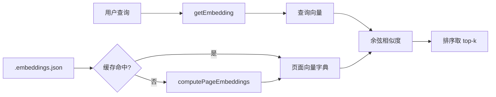

# 语义搜索与 Embedding

Wiki CLI 的语义搜索是将自然语言查询转化为向量，在 Wiki 页面向量空间中寻找语义最近邻的过程。其核心引擎位于 `src/ai/embeddings.ts`，通过一个三层缓存架构和余弦相似度计算，实现快速、准确的跨页面检索。

## 三步流程

`semanticSearch` 函数的逻辑可以拆解为三个清晰的步骤：



**第一步 —— 查询向量化：** 调用 `getEmbedding` 函数，向配置的 `/embeddings` 端点发送 POST 请求，将用户输入的查询文本转为固定维度的数值向量。

**第二步 —— 页面向量获取：** 从缓存（内存或磁盘）中读取各 Wiki 页面的向量表示。如果缓存不存在或模型已变更，则调用 `computePageEmbeddings` 遍历所有 `.md` 文件并逐页生成向量。

**第三步 —— 相似度排序：** 将查询向量逐一与页面向量计算余弦相似度，按得分降序排列，返回 top-k 结果。

[来源](src/ai/embeddings.ts#L68-L116)

---

## 向量生成：getEmbedding

`getEmbedding` 是对 Embedding API 的轻量封装，遵循 OpenAI 兼容规范：

```typescript
export async function getEmbedding(
  text: string,
  config: EmbeddingConfig
): Promise<number[]> {
  const url = `${config.baseUrl.replace(/\/+$/, '')}/embeddings`;
  const response = await fetch(url, {
    method: 'POST',
    headers: {
      'Content-Type': 'application/json',
      'Authorization': `Bearer ${config.apiKey}`,
    },
    body: JSON.stringify({ model: config.model, input: text }),
  });
  // ...
  return result.data[0].embedding;
}
```

接口定义 `EmbeddingConfig` 包含四个字段：`provider`、`model`、`baseUrl` 和 `apiKey`，与 [](自定义-llm-与-embedding.md) 中的配置体系一致。函数不做重试或流式处理——Embedding 调用天然是单次请求，失败直接抛出异常。

[来源](src/ai/embeddings.ts#L1-L10)

[来源](src/ai/embeddings.ts#L30-L48)

---

## 批量计算：computePageEmbeddings

当缓存缺失或模型变更时，`computePageEmbeddings` 负责为所有 Wiki 页面重新生成向量：

```typescript
export async function computePageEmbeddings(
  wikiPath: string,
  config: EmbeddingConfig,
  pageFiles: string[]
): Promise<Record<string, number[]>> {
  const result: Record<string, number[]> = {};
  for (const file of pageFiles) {
    const content = await readFile(join(wikiPath, file), 'utf-8');
    const slug = file.replace(/\.md$/, '');
    result[slug] = await getEmbedding(content.slice(0, 8000), config);
  }
  return result;
}
```

注意两个实现细节：

- **slug 提取：** 文件名去掉 `.md` 后缀即为页面标识符，与 Wiki 生成阶段的 slug 规则保持一致。
- **内容截断：** 每个页面只取前 8000 字符送入模型。这是常见的 Embedding 实践——大多数模型的上下文窗口有限，且页面首部通常已包含核心语义。
- **容错：** 单个页面失败时静默跳过，不影响整体流程。

[来源](src/ai/embeddings.ts#L50-L65)

---

## 三层缓存策略

缓存是 `semanticSearch` 中最精妙的设计。它通过 **内存 → 磁盘 → 重新计算** 三级优先级，在速度和新鲜度之间取得平衡。

### 1. 内存缓存（最快）

```typescript
let embeddingCache: {
  data: Record<string, number[]>;
  model: string;
  wikiPath: string;
} | null = null;
```

首次搜索后，页面向量会保留在进程内存中。后续同样 `wikiPath` 和相同 `model` 的搜索直接命中，零 I/O。

### 2. 磁盘缓存（.embeddings.json）

内存未命中时，读取 Wiki 目录下的 `.embeddings.json` 文件：

```typescript
interface CacheData {
  _model: string;       // 生成时的模型名
  _generated: string;   // 生成时间戳
  [slug: string]: number[] | string;  // 页面向量
}
```

关键校验逻辑：对比 `_model` 与当前配置的 `config.model`。如果一致则直接反序列化使用；如果不同，说明用户切换了 Embedding 模型，自动触发 **重新计算**。

### 3. 写入策略

无论是初次计算还是模型变更后的重算，结果都会通过 `saveCache` 持久化到 `.embeddings.json`，同时更新内存缓存。写入失败不阻塞主流程——缓存是非关键路径。

### 4. 缓存清理

`clearEmbeddingCache()` 函数将内存缓存置为 `null`，用于测试场景或配置变更后的强制刷新。

[来源](src/ai/embeddings.ts#L12-L26)

[来源](src/ai/embeddings.ts#L82-L114)

[来源](src/ai/embeddings.ts#L119-L134)

---

## 余弦相似度：纯算术实现

`cosineSimilarity` 函数不依赖任何第三方数值库，用原生循环实现：

```typescript
function cosineSimilarity(a: number[], b: number[]): number {
  let dot = 0, na = 0, nb = 0;
  for (let i = 0; i < a.length; i++) {
    dot += a[i] * b[i];
    na += a[i] * a[i];
    nb += b[i] * b[i];
  }
  return dot / (Math.sqrt(na) * Math.sqrt(nb));
}
```

这个实现等价于公式 $\frac{A \cdot B}{\|A\| \|B\|}$，返回值范围 $[-1, 1]$，值越大表示语义越接近。循环中同时累加点积和 L2 范数，只需一次遍历即可完成计算，对任意维度的向量均适用。

选择纯算术而非库依赖的原因很明确：Embedding 维度通常在 1024-4096 之间，简单循环已经足够快；零依赖意味着更小的包体积和更快的安装体验。

[来源](src/ai/embeddings.ts#L18-L26)

---

## 工具层的增强：titleMap

`src/ai/tools.ts` 中的 `semantic_search` 工具是对核心引擎的额外封装。它在调用 `semanticSearch` 之前动态导入 embeddings 模块，获取结果后通过 `index.json` 中的结构化元数据构建 **titleMap**：

```typescript
const jsonPath = join(wikiPath, 'index.json');
let titleMap: Record<string, string> = {};
if (existsSync(jsonPath)) {
  const raw = await readFile(jsonPath, 'utf-8');
  const parsed = JSON.parse(raw);
  for (const s of parsed.sections || []) {
    for (const t of s.topics || []) {
      if (t.type !== 'group' && t.title) {
        const slug = t.title.toLowerCase()
          .replace(/[^\w\u4e00-\u9fff]+/g, '-')
          .replace(/^-+|-+$/g, '') || 'untitled';
        titleMap[slug] = t.title;
      }
    }
  }
}
```

这一增强的意义在于：核心 `semanticSearch` 只返回 slug（如 `语义搜索与-embedding`），而工具层将其映射为可读的中文标题（如"语义搜索与 Embedding"），使 AI Agent 或终端用户能直接理解结果含义。最终返回的数据包含 `slug`、`title` 和四舍五入到三位小数的 `score`。

工具层还负责前置验证：如果 Embedding 未配置，直接返回 `'Embedding not configured. Run wiki-cli config to set up.'` 的错误信息。

[来源](src/ai/tools.ts#L564-L593)

---

## 配置集成

Embedding 配置由 `src/commands/config.ts` 中的交互式向导管理，支持以下模型预设：

| Provider | 推荐模型 | 维度 | 适用场景 |
|----------|---------|------|---------|
| OpenAI | text-embedding-3-small | 1536 | 日常 RAG，性价比最高 |
| Google Gemini | gemini-embedding-2 | 3072 | MTEB 领先，跨模态 |
| Cohere | embed-v4 | 4096 | 100+ 语言多语言 |
| Voyage AI | voyage-4-lite | 2048 | 高吞吐轻量版 |
| Jina AI | jina-embeddings-v3 | 1024 | 长上下文/多语言 |

用户也可选择 **Custom** 模式，手动指定 Base URL 和模型名，兼容任何 OpenAI 兼容的 Embedding API。

配置通过 `initTools` 注入到 tools 模块的全局变量中，`ai` 命令启动时根据 `config.embeddingModel`、`config.embeddingBaseUrl` 和 `config.embeddingApiKey` 三个值决定是否启用：

```typescript
if (config.embeddingModel && config.embeddingBaseUrl && config.embeddingApiKey) {
  initTools({ provider, model, baseUrl, apiKey }, webConfig, workDir);
} else {
  initTools(undefined, webConfig, workDir);
}
```

缺少任一字段时语义搜索工具不可用，AI Agent 会自动从工具列表中移除 `semantic_search`。

[来源](src/config/config-store.ts#L43-L50)

[来源](src/commands/ai.ts#L73-L84)

[来源](src/commands/ai.ts#L119-L121)

---

## 下一步

- 了解 Embedding 模型的选型和自定义配置：[](自定义-llm-与-embedding.md)
- 查看 `semantic_search` 在 Agent 工具系统中的完整定义：[](tool-系统-定义与执行.md)
- 掌握 Embedding 配置的交互式设置流程：[](配置文件详解.md)