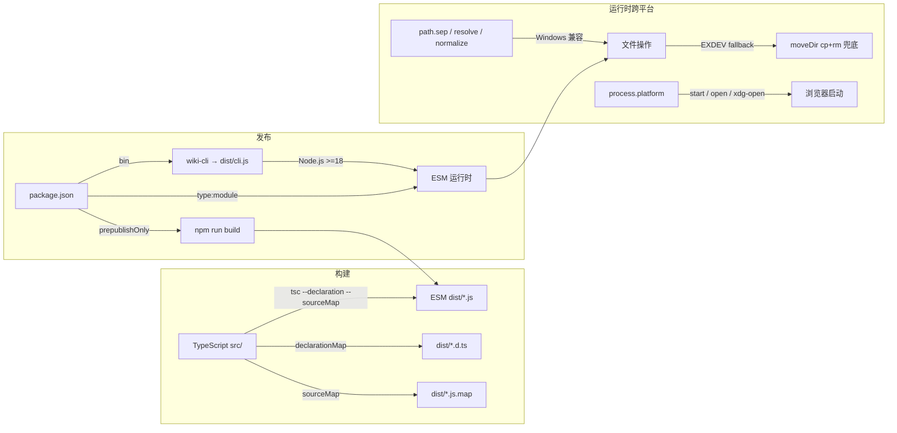

# 跨平台兼容与发布

## 模块系统：ESM 优先

`package.json` 中的 `"type": "module"` 将整个项目声明为 **ES Module**。这是一项事关全局的决策：所有 `.ts` 文件在编译后自动输出 ESM 语法，依赖的导入语句必须遵循 ESM 的静态分析规则。例如，`import ora from 'ora'` 在 ESM 下工作正常，但若某依赖仅提供 CommonJS（如旧版 chalk@4），就会触发 Node.js 的 ESM-CJS 互操作限制。`commander`（^12.1.0）、`chalk`（^5.4.1）、`inquirer`（^12.3.0）和 `ora`（^8.1.1）的最新主版本均已原生支持 ESM，这是项目选择它们而非低版本的直接原因。[来源](package.json#L2-L26)

`engine` 约束 `"node": ">=18"` 提供了两个关键能力：一是原生 `fetch` API（免 `node-fetch` 依赖），二是完整的 ESM 支持（Node.js 16 虽标注 ESM 稳定，但 18 中修复了大量边缘问题）。所有 import 路径均使用 `.js` 后缀（如 `from './progress.js'`），这是 TypeScript ESM 输出的约定——编译后的 `.js` 文件保持与源码中 `.js` 后缀一致的引用关系。[来源](package.json#L35-L36)

## TypeScript 构建配置

`tsconfig.json` 的编译目标设为 `"ES2022"`，这意味着输出的 JavaScript 可使用 `Array.prototype.at`、`Object.hasOwn`、`Error.cause` 等 ES2022 特性，Node.js 18 以上版本完全支持。模块格式为 `"ESNext"`，配合 `"moduleResolution": "bundler"`——后者允许 TypeScript 省去传统 Node.js 模块解析的复杂规则，直接按 bundler（如 esbuild、tsc）的规则查找依赖。[来源](tsconfig.json#L2-L7)

```
源文件 (src/)        编译输出 (dist/)
─────────────────────────────────────
src/cli.ts          → dist/cli.js
src/utils/file.ts   → dist/utils/file.js
src/commands/       → dist/commands/
```

输出相关的三个标志：

| 配置 | 作用 |
|------|------|
| `declaration: true` | 生成 `.d.ts` 类型声明文件，供外部消费者获取完整的类型信息 |
| `declarationMap: true` | 生成 `.d.ts.map`，IDE 可跳转到原始 `.ts` 源码而非 `.d.ts` 占位符 |
| `sourceMap: true` | 生成 `.js.map`，运行时错误堆栈映射回 `.ts` 行号 |

三者配合实现了对开发者和库使用者的双赢：开发者调试时看到的是 TypeScript 源码而非被编译后的 JavaScript；API 消费者在 VSCode 中按 `F12` 能直接跳转到 `.ts` 源码的声明。[来源](tsconfig.json#L13-L15)

`rootDir` 为 `./src`，`outDir` 为 `./dist`，目录结构完全一致。`include` 只覆盖 `src/**/*`，排除 `node_modules`、`dist` 和 `tests`。[来源](tsconfig.json#L16-L18)

## CLI 入口与 bin 字段

`package.json` 的 `bin` 字段将 `wiki-cli` 命令映射到 `dist/cli.js`：

```json
"bin": {
  "wiki-cli": "dist/cli.js"
}
```

`dist/cli.js` 顶部包含 `#!/usr/bin/env node` shebang。当用户通过 `npm install -g wiki-cli` 全局安装后，npm 会在 PATH 中创建符号链接指向该文件，操作系统根据 shebang 自动调用 Node.js 执行。[来源](package.json#L5-L7)

`prepublishOnly` 脚本确保 `npm publish` 前自动执行 `npm run build`（即 `tsc`），防止发布未编译的源码。[来源](package.json#L14)

## 跨设备目录移动：EXDEV 回退

`moveDir` 函数代表了文件系统操作中最易被忽视的跨平台陷阱——**跨设备重命名**（EXDEV）。在 Linux/macOS 上，`rename(src, dest)` 原子性地将目录从一个位置移动到另一个位置，即使跨越文件系统边界也会成功。但在 Windows 上，当 `src` 和 `dest` 处于不同盘符（如 `C:\` 和 `D:\`）时，`rename` 抛出 `EXDEV` 错误。

实现采用 try-catch 兜底策略：

```ts
export async function moveDir(src: string, dest: string): Promise<void> {
  try {
    await rename(src, dest);
  } catch (err: any) {
    if (err.code === 'EXDEV') {
      await cp(src, dest, { recursive: true });
      await rm(src, { recursive: true, force: true });
    } else {
      throw err;
    }
  }
}
```

捕获 `EXDEV` 后，先用 `cp` 递归复制，再用 `rm` 删除源目录。仅针对 `EXDEV` 做回退，其他错误（权限不足、路径不存在）立即抛出，避免静默吞掉真正的异常。[来源](src/utils/file.ts#L32-L42)

## Windows 路径处理

路径操作的三个层次贯穿整个代码库：

**1. 分割符抽象**

`node:path` 的 `sep` 在 Windows 上为 `\`，在 POSIX 上为 `/`。`writeTextFile` 使用 `filePath.split(sep)` 提取目录部分，而非硬编码 `/`。[来源](src/utils/file.ts#L18)

**2. 用户输入规范化**

`config.ts` 中，用户在交互式提示下输入的仓库目录路径会经过 `replace(/\\/g, '/')` 清洗——Windows 用户在 CMD 或 PowerShell 中粘贴的路径通常包含反斜杠，统一转为正斜杠后再存入配置，后续用 `node:path` 的函数（自动识别斜杠方向）处理。[来源](src/commands/config.ts#L297)

**3. 浏览器打开命令**

`browse.ts` 根据 `process.platform` 选择浏览器启动命令：

- `win32` → `start`
- `darwin` → `open`
- 其他 → `xdg-open`

[来源](src/commands/browse.ts#L439-L440)

**4. 路径遍历防护**

`sanitizePath` 在接受用户输入的路径参数时，先清洗开头的 `/` 和 `\`，再用 `normalize` 解析路径，最后检查解析后的结果是否仍在 `root` 目录内——防止 `../../../etc/passwd` 类型的路径穿越攻击。对 `..` 片段的过滤使用了 `replace(/^(\.\.(\/|\\))+/g, '')` 同时匹配正斜杠和反斜杠两种分隔符。[来源](src/commands/browse.ts#L532-L535)

## ESM 兼容的依赖链

项目依赖的选择遵循一条隐性约束：所有运行时依赖必须提供 ESM 入口。下表列出关键依赖及其版本号后的 ESM 状态：

| 依赖 | 版本 | ESM 支持 |
|------|------|----------|
| chalk | ^5.4.1 | 5.x 起纯 ESM，无 CommonJS 导出 |
| inquirer | ^12.3.0 | 9.x 起纯 ESM，12.x 完全 ESM 重写 |
| ora | ^8.1.1 | 6.x 起纯 ESM |
| commander | ^12.1.0 | 支持 ESM 和 CJS 双入口 |
| highlight.js | ^11.11.0 | 11.x 原生 ESM |
| marked | ^15.0.4 | 纯 ESM |
| mermaid | ^11.14.0 | 纯 ESM |

这些依赖的导入方式均为 `import foo from 'foo'` 或 `import { bar } from 'foo'`，没有使用 `require()`。如果项目混入一个仅支持 CJS 的依赖，Node.js 会抛 `ERR_REQUIRE_ESM` 错误——这是选择依赖版本时的硬性过滤条件。[来源](package.json#L16-L25)

## 发布配置

`.gitignore` 排除了 `node_modules/`、`dist/`、`.wiki/sessions/`、`.env` 和 `*.log`。[来源](.gitignore)

当执行 `npm publish` 时，npm 首先检查 `.gitignore` 和 `.npmignore`（不存在时默认继承 `.gitignore`），因此 `dist/` 不会被发布。需要显式在 `package.json` 中添加 `"files"` 字段来控制发布内容——项目当前未设置该字段，这意味着 `npm publish` 会跳过 `dist/` 目录，仅发布源码和元数据文件，**因此用户在安装后无法运行`wiki-cli`命令**（因为 `dist/cli.js` 不存在）。这是当前发布配置中需要补全的关键缺口：[来源](package.json#L4-L8)

```json
"files": [
  "dist",
  "README.md",
  "LICENSE"
]
```

加上 `"files": ["dist", "README.md"]` 后，`prepublishOnly` 脚本的 `npm run build` 将保证 `dist/` 在发布前构建完毕。[来源](package.json#L14)

## 全局路径与 process.chdir 解耦

跨平台环境下的另一个隐患是 `process.chdir()` 的全局副作用。`workspace.ts` 中，`resolveWorkDir` 在切换工作目录后返回 `workDir` 路径，所有后续命令通过显式传递的 `workDir` 而非 `process.cwd()` 来定位文件。[来源](src/utils/workspace.ts#L59-L106)

`ai-session.ts` 中的 `setSessionsDir` 函数允许各命令直接指定会话目录，而非依赖 `process.cwd()` 的隐式状态。[来源](src/ai/ai-session.ts#L22-L29)

`tools.ts` 的 `initTools` 接受可选的 `root` 参数，传入后所有 Git 命令和文件查找都基于 `projectRoot`，避免 `process.chdir()` 的影响扩散到工具执行层。[来源](src/ai/tools.ts#L471-L473)

## 综合架构



## 推荐阅读

- [文件与日志工具](文件与日志工具.md) — 跨平台文件操作工具函数的完整说明
- [工作目录解析](工作目录解析.md) — `resolveWorkDir` 的路径解析和缓存策略
- [命令行入口与命令注册](命令行入口与命令注册.md) — CLI 入口和命令注册体系
- [测试策略](测试策略.md) — 包含跨平台场景的测试用例