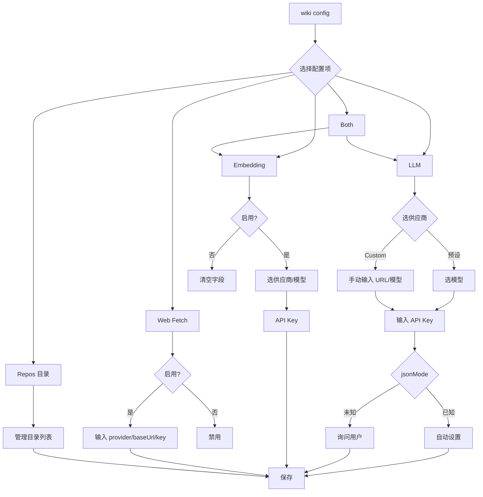

# 配置文件详解

wiki-cli 的所有配置都集中在一个 JSON 文件中。你不必手动编辑它——`wiki config` 命令提供了交互式向导——但了解每个字段的含义，能帮你更灵活地控制工具行为。

---

## 配置文件存在哪里？

文件保存在 **用户主目录** 下的 `.wiki-cli/config.json`。

| 操作系统 | 完整路径 |
|---|---|
| macOS / Linux | `~/.wiki-cli/config.json` |
| Windows | `C:\Users\你的用户名\.wiki-cli\config.json` |

代码中通过 `os.homedir()` 获取用户主目录，然后拼接 `.wiki-cli/config.json`：

```typescript
const CONFIG_DIR = join(homedir(), '.wiki-cli');
const CONFIG_PATH = join(CONFIG_DIR, 'config.json');
```

你可以调用 `getConfigPath()` 随时查看路径。[来源](src/config/config-store.ts#L58-L59)

首次运行 `wiki config` 时，工具会自动创建这个目录和文件。

---

## 配置字段一览

`WikiCliConfig` 接口定义了 JSON 中所有的键。下表按功能分组说明：

### LLM 配置（必须）

| 字段 | 类型 | 含义 |
|---|---|---|
| `provider` | `string` | 供应商名称，如 `"OpenAI"`、`"DeepSeek"` |
| `baseUrl` | `string` | API 端点，如 `"https://api.openai.com/v1"` |
| `model` | `string` | 模型名称，如 `"gpt-5.4-mini"` |
| `apiKey` | `string` | API 密钥，明文存储 |
| `lang` | `string` | 生成文档的语言，默认 `"zh"` |
| `jsonMode` | `boolean`（可选） | 是否启用 JSON 输出模式 |

这四个字段是 wiki-cli 的**核心**——所有 Wiki 页面都由你指定的 LLM 生成。

### Embedding 配置（可选，用于语义搜索）

| 字段 | 类型 | 含义 |
|---|---|---|
| `embeddingProvider` | `string`（可选） | Embedding 供应商，如 `"Voyage AI"` |
| `embeddingModel` | `string`（可选） | 嵌入模型，如 `"voyage-4-large"` |
| `embeddingBaseUrl` | `string`（可选） | Embedding API 地址 |
| `embeddingApiKey` | `string`（可选） | Embedding API 密钥，留空则复用 `apiKey` |

配置此项后，[AI 问答](ai-问答.md) 中的语义搜索和 [语义搜索与 Embedding](语义搜索与-embedding.md) 功能才能工作。

### Web Fetch 配置（可选，用于 AI 读取文档链接）

| 字段 | 类型 | 含义 |
|---|---|---|
| `webFetchDisabled` | `boolean`（可选） | 设为 `true` 禁用 |
| `webFetchProvider` | `string`（可选） | 服务商，默认 `"jina"` |
| `webFetchBaseUrl` | `string`（可选） | API 地址，默认 `"https://r.jina.ai"` |
| `webFetchApiKey` | `string`（可选） | API 密钥（免费层可留空） |

### Repos 配置（可选）

| 字段 | 类型 | 含义 |
|---|---|---|
| `repoDirs` | `string[]`（可选） | 仓库缓存目录列表，首项为默认目录 |

默认目录为 `~/.wiki-cli/repos`。仅在配置了多个目录时写入此字段。[来源](src/config/config-store.ts#L11-L22)

---

## supportsJsonMode：JSON 模式的自动判定

JSON 模式（`jsonMode`）让 LLM 的输出严格遵循 JSON 格式，是 [两阶段生成引擎](两阶段生成引擎.md) 稳定解析模型回复的关键。

`supportsJsonMode(provider)` 函数的判定逻辑很简单：

```typescript
const JSON_MODE_PROVIDERS = new Set([
  'OpenAI',
  'DeepSeek',
  'xAI Grok',
  'Mistral',
  'Kimi (Moonshot)',
]);

export function supportsJsonMode(provider: string): boolean | undefined {
  if (provider === 'Custom') return undefined;
  return JSON_MODE_PROVIDERS.has(provider);
}
```

三种返回值含义如下：

| 返回值 | 含义 |
|---|---|
| `true` | 该供应商已知支持 JSON 模式，自动启用 |
| `false` | 该供应商已知**不支持**，自动关闭（如 Google Gemini、Anthropic） |
| `undefined` | 供应商未知（Custom），需要**用户手动确认** |

[来源](src/config/config-store.ts#L46-L52)

也就是说，当你选择预设供应商时，程序自动替你决定 `jsonMode`；当你选择 **Custom** 时，交互向导会弹出一个确认提问："Does this provider support JSON output mode?"。[来源](src/commands/config.ts#L96-L101)

---

## 自定义 Provider：接入任意兼容 API

如果你使用的 LLM 不在预设列表中，可以选 `"Custom"`。自定义模式需要你手动填写三个字段：

1. **Base URL** —— API 端点地址
2. **Model** —— 模型名称字符串
3. **API Key** —— 密钥

工具不与任何特定供应商绑定——只要 API 兼容 OpenAI 的 `/v1/chat/completions` 格式，就能工作。这也包括本地部署的模型（如 Ollama、vLLM）。[来源](src/commands/config.ts#L77-L86)

Embedding 同样支持自定义 Provider，流程一致。[来源](src/commands/config.ts#L139-L148)

详细了解：[自定义 LLM 与 Embedding](自定义-llm-与-embedding.md)

---

## 分步配置流程：wiki config

`src/commands/config.ts` 实现了完整的交互式配置体验。当你运行 `wiki config` 时，首先看到一个菜单：

```
? What do you want to configure?
  LLM (provider / model / API key)
  Embedding (semantic search model)
  Web Fetch (let AI read documentation URLs)
  Repos Directory (where to store cloned repos)
  Both
  Done, quit
```

每种模式的配置路径如下：

### 1. 配置 LLM

```
选择供应商 → 选择模型 → 输入 API Key → 确认 JSON 模式（Custom 时）
```

- 预设供应商列表来自 `default-models.json`，目前包含 **7 个供应商、21 个模型**（OpenAI、Google Gemini、Anthropic、xAI Grok、DeepSeek、Kimi、Mistral）。
- 选 **Custom** 时，`provider` 被设为 `"Custom"`，`jsonMode` 需手动确认。[来源](src/commands/config.ts#L59-L102)

### 2. 配置 Embedding

```
是否启用？→ 选择供应商 → 选择模型 → 输入 API Key（可复用 LLM 的）
```

- 预设列表：**8 个供应商、9 个模型**（OpenAI ×3、Google Gemini、Cohere、Voyage AI ×2、Jina AI、Mistral）。
- API Key 留空时自动复用 `apiKey`。[来源](src/commands/config.ts#L104-L165)

### 3. 配置 Web Fetch

```
是否启用？→ provider（默认 jina）→ Base URL（默认 https://r.jina.ai）→ API Key（可选）
```

- 工具使用 Jina Reader 将文档 URL 转为 Markdown，供 AI 读取。
- API Key 留空使用免费层，填写后可获得更高速率限制。[来源](src/commands/config.ts#L167-L196)

### 4. 配置 Repos 目录

```
显示当前列表 → 新增 / 设为默认 / 移除 → 完成
```

- 默认目录 `~/.wiki-cli/repos` 是首项，不可移除。
- 当只有一个默认目录时，`repoDirs` 字段不写入 JSON。[来源](src/commands/config.ts#L198-L248)

### 5. 使用命令行参数快速配置

如果你不想走交互菜单，也可以直接传参：

```bash
wiki config --provider OpenAI --model gpt-5.4-mini --baseUrl https://api.openai.com/v1 --apiKey sk-xxx --lang zh
```

参数和交互结果都会保存到同一个 `config.json`。[来源](src/commands/config.ts#L16-L22)

---

## 配置流程图



---

## 下一步

- 配置完成后，即可开始 [生成 Wiki](生成-wiki.md)
- 如果想在配置中同时设置 LLM 和 Embedding，选择 `Both` 一步到位
- 接入本地模型或非标准 API，阅读 [自定义 LLM 与 Embedding](自定义-llm-与-embedding.md)
- 完整的 CLI 入口设计见 [命令行入口与命令注册](命令行入口与命令注册.md)